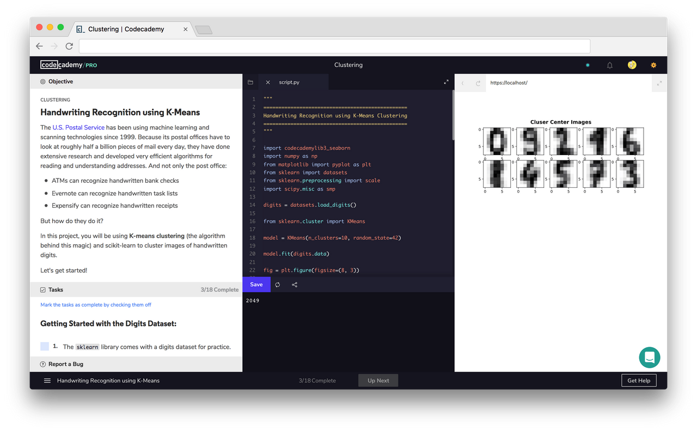

<br />

<p align="center">
  <a href='https://www.codecademy.com/'></a>
</p>

<br />

<p align="justify">
  <a href="https://www.codecademy.com/">Codecademy</a> want to create a world where anyone can build something meaningful with technology, and everyone has the learning tools, resources, and opportunities to do so. Code contains a world of possibilities — all that’s required is the curiosity and drive to learn. At Codecademy, we are committed to empowering all people, regardless of where they are in their coding journeys, to continue to learn, grow, and make an impact on the world around them.
</p>

<!-- <p align="center">
  
</p> -->

<!-- ################################################################ -->
<!-- 
<h1 align="center">Best System for Learning to Code</h1>

## 1. Choose What to Learn <a href='README/1.webp'></a>
From building websites to analyzing data, the choice is yours. Not sure where to start? We'll point you in the right direction.

<br>

## 2. Learn by Doing <a href='README/2.webp'></a>
No matter your experience level, you'll be writing real, working code in minutes.

<br>

## 3. Get Instant Feedback <a href='README/3.webp'></a>
Your code is tested as soon as you submit it, so you always know if you're on the right track.

<br>

## 4. Put Your Learning into Practice <a href='README/4.webp'></a>
Apply your learning with real-world projects and test your knowledge with tailor-made quizzes.

<br>

## 5. Land Your Dream Job <a href='README/5.webp'></a>
Coding skills have never been more in-demand. Learn everything you need to take your career to the next level.

<br><br> -->

<!-- ################################################################ -->

---

<details><summary>Certificate 📃</summary>

<p align="center">
  
</p>

</details>

---

<br>

<h1 align="center">Data Scientist Learning Path</h1>

## **1. Welcome to the Data Scientist Career Path**

<details><summary>Details</summary>

The Data Scientist Career Path is designed for you to gain the technical skills, knowledge, resources, and confidence you need to get your start as a data scientist.

**After this Path, you will be able to:**

- Create programs using Python 3
- Move off of the Codecademy platform with the Command Line, Jupyter Notebook, Git, and GitHub Desktop
- Acquire and query data with SQL and BeautifulSoup
- Manipulate data using NumPy and pandas
- Wrangle and tidy data with pandas
- Summarize and analyze data with scikit-learn
- Implement many different hypothesis tests using Python
- Visualize data using Matplotlib and seaborn
- Communicate data science findings effectively
- Work with text data using natural language processing
- Build, train, and test a variety of supervised and unsupervised machine learning models
- Understand the fundamentals of deep learning
- Work with aggregate functions and joins in SQL

---

**Popular Data Science Resources**

As you go through the path, we’ll suggest certain resources for you to use, like articles, videos, tutorials, and documentation. Here are some additional resources that are considered groundbreaking, significant, or classics in the industry and will help you throughout your Path:

- Documentation: 
    - [NumPy Manual](https://numpy.org/doc/stable/)
    - [Jupyter Notebook](https://jupyter-notebook.readthedocs.io/en/stable/)
    - [Pandas Documentation](https://pandas.pydata.org/docs/index.html)
    - [API reference — seaborn](https://seaborn.pydata.org/api.html)
    - [Matplotlib: Python plotting](https://matplotlib.org/)
    - [The Python Standard Library](https://docs.python.org/3/library/index.html)
    - [The Data Visualization Catalogue](https://datavizcatalogue.com/)

- Cheatsheet: 
    - [SQL Cheatsheet](https://www.codecademy.com/learn/learn-sql/modules/learn-sql-manipulation/cheatsheet)
    - [Regex Cheatsheet](https://www.codecademy.com/learn/practical-data-cleaning/modules/data-cleaning-with-pandas/cheatsheet)
    - [Hypothesis Testing Cheatsheet](https://www.codecademy.com/learn/stats-hypothesis-testing/modules/hypothesis-testing-testing-a-sample-statistic/cheatsheet)
    - [Statistics for Data Analysis Cheatsheet](https://www.codecademy.com/learn/ida-6-statistics-for-data-analysis/modules/ida-6-1-variance-and-standard-deviation/cheatsheet)
    - [More ...](Data%20Scientist%20Career%20Path\1.%20Welcome%20to%20the%20Data%20Scientist%20Career%20Path\Cheatsheets)

- Books:
    - [A Whirlwind Tour of Python, Jake VanderPlas](https://nbviewer.jupyter.org/github/jakevdp/WhirlwindTourOfPython/blob/master/Index.ipynb)
    - [Python for Data Analysis: Data Wrangling with Pandas, Numpy, and Ipython, Wes McKinney](https://bookshop.org/books/python-for-data-analysis-data-wrangling-with-pandas-numpy-and-ipython-9781491957660/9781491957660)
    - [Python Data Science Handbook, Jake VanderPlas](https://bookshop.org/books/python-data-science-handbook-essential-tools-for-working-with-data/9781491912058), also available for free [here](https://jakevdp.github.io/PythonDataScienceHandbook/)
    - [Algorithms of Oppression: How Search Engines Reinforce Racism, Safiya Umoja Noble](https://bookshop.org/books/algorithms-of-oppression-how-search-engines-reinforce-racism/9781479837243)
    - [Introduction to Machine Learning with Python: A Guide for Data Scientists, Andreas C. Müller, Sarah Guido](https://bookshop.org/books/introduction-to-machine-learning-with-python-a-guide-for-data-scientists/9781449369415)
    - [Weapons of Math Destruction: How Big Data Increases Inequality and Threatens Democracy, Cathy O’Neil](https://bookshop.org/books/weapons-of-math-destruction-how-big-data-increases-inequality-and-threatens-democracy/9780553418835)
    - [Python Feature Engineering Cookbook, Soledad Galli](https://bookshop.org/books/weapons-of-math-destruction-how-big-data-increases-inequality-and-threatens-democracy/9780553418835)
    - [Deep Learning with Python, François Chollet](https://bookshop.org/books/deep-learning-with-python/9781617294433)

</details>

## **2. Getting Started with Data Science**

<details><summary>Details</summary>

### **a. Introduction to Data Science**

Data science enables us to take data and transform it into meaningful information that can help us make decisions. Data science is interdisciplinary and combines other well-known fields such as probability, statistics, analytics, and computer science. The work that you might do could range from writing up reports to building machine learning models. No matter what your interests are, data science is applicable - because these days, we have data on everything!

<p align="center">
  
</p>

#### **1) Statistics**

A fundamental part of data science is statistics. Statistics is the practice of applying mathematical calculations to sets of data to derive meaning. Statistics can give us a quick summary of a dataset, such as the average amount or how consistent a dataset is.

There are two types of statistics: 

- **Descriptive Statistics**

    Descriptive statistics describe a dataset using mathematically calculated values, such as the mean and standard deviation. For instance, the graph below from [FiveThirtyEight](https://fivethirtyeight.com/features/heres-what-the-gender-pay-gap-looks-like-by-income-level/) charts the wage gap between American men and women in 2014. An example of a descriptive statistic would be that at the 90th income percentile, women make 80.6% of what men make on average.

- **Inferential Statistics**

    On the other hand, inferential statistics are statistical calculations that enable us to draw conclusions about the larger population. For instance, from looking at the graph we can infer that at the 99th income percentile, women make less than 78% of what men make on average. We can also infer that the reason why the wage gap is smallest at the 10th income percentile is because the minimum wage for men and women is the same.

#### **2) Probability**

Another field that informs the field of data science is probability. Probability is the mathematical study of what could potentially happen. Fun fact: the study of probability came about as a method to decode secret messages.

In data science, probability calculations are used to build models. Models are able to help us understand data that has yet to exist - either data we hadn’t previously collected or data that has yet to be created. Data scientists create models to help calculate the probability of a certain action and then they use that probability to make informed decisions.

[Example of Probability Application](Data%20Scientist%20Career%20Path\2.%20Getting%20Started%20with%20Data%20Science\1.%20Introduction%20to%20Data%20Science\probability.py)

#### **3) Programming**

Given that we’re a “learn to code” website, this one may seem fairly obvious. But in all seriousness, programming is an essential part of data science. It’s also what sets data science apart from similar fields, like data analytics.

Programming is the practice of writing commands for a computer to execute. Computer Science is the discipline of interacting with computation systems.

[Example of Programming Application](Data%20Scientist%20Career%20Path\2.%20Getting%20Started%20with%20Data%20Science\1.%20Introduction%20to%20Data%20Science\programming.py)

#### **4) Domain Expertise**

One of the reasons that data science is one of the most interesting fields to go into is that it doesn’t limit you to a specific industry. Interested in airplanes? Work for a company on ticket pricing! Like fashion? Create a model that predicts the latest trends.

<p align="center">
  
</p>

Domain Expertise refers to the particular set of knowledge that someone cultivates in order to understand their data. You may be able to crunch the numbers, but in order to understand their meaning, you’re going to need a lot of context. Sometimes this context comes from your research, your teammates, or the knowledge that you gain after working in a particular industry.

#### **Review**

Review! You now know the basic parts that make up the field of data science.

- Data Science—the field of taking data and transforming it into meaningful information that can help us make decisions
- Descriptive Statistics—statistics that describe the data in objective terms
- Inferential Statistics—inferences for the overall population based on data
- Probability—the likelihood that an event will happen
- Programming—the act of giving the computer instructions to perform a task
- Domain Expertise—the particular set of knowledge that someone cultivates and brings with them in order to understand their data

If you are interested in learning more about these topics, here are some additional resources:

- Blog: [What does a data scientist do?](https://news.codecademy.com/what-does-a-data-scientist-do/)
- Article: [What Data Scientists Really Do, According to 35 Data Scientists](https://hbr.org/2018/08/what-data-scientists-really-do-according-to-35-data-scientists)
- Article: [Achieving business impact with data](https://www.mckinsey.com/business-functions/mckinsey-analytics/our-insights/achieving-business-impact-with-data#)

---

### **b. Data Science Process**

<p align="center">
  
</p>

### **c. Data Science Applications**

As you can see, there are many different applications and kinds of projects that you can do once you know a bit of data science!

- Reports - a way of presenting your process, insights, and recommendations
- Recommender Systems - a process that uses data about users and items to predict interest
- Dynamic Pricing - a strategy that takes into account factors such as demand to increase and decrease prices to drive profit
- Natural Language Processing - ways of analyzing text to gain insights as well as support applications, such as chatbots

Of course, there are many applications beyond just the ones that we’ve covered here. So no matter your interest or professional industry, data science thinking can create impact.

</details>

## **3. Python Fundamentals**

<details><summary>Details</summary>

### **a. Python Syntax and Variable Types**

<details><summary>Details</summary>

Python is a programming language. Like other languages, it gives us a way to communicate ideas. In the case of a programming language, these ideas are “commands” that people use to communicate with a computer!

0) [Welcome](Data%20Scientist%20Career%20Path\3.%20Python%20Fundamentals\1.%20Python%20Syntax%20and%20Variable%20Types\1.%20welcome.py)
1) [Comment](Data%20Scientist%20Career%20Path\3.%20Python%20Fundamentals\1.%20Python%20Syntax%20and%20Variable%20Types\2.%20comments.py)
2) [Print](Data%20Scientist%20Career%20Path\3.%20Python%20Fundamentals\1.%20Python%20Syntax%20and%20Variable%20Types\3.%20print.py)
3) [String](Data%20Scientist%20Career%20Path\3.%20Python%20Fundamentals\1.%20Python%20Syntax%20and%20Variable%20Types\4.%20strings.py)
4) [Variables](Data%20Scientist%20Career%20Path\3.%20Python%20Fundamentals\1.%20Python%20Syntax%20and%20Variable%20Types\5.%20variables.py)
5) [Errors](Data%20Scientist%20Career%20Path\3.%20Python%20Fundamentals\1.%20Python%20Syntax%20and%20Variable%20Types\6.%20errors.py)
6) [Numbers](Data%20Scientist%20Career%20Path\3.%20Python%20Fundamentals\1.%20Python%20Syntax%20and%20Variable%20Types\7.%20numbers.py)
7) [Calculations](Data%20Scientist%20Career%20Path\3.%20Python%20Fundamentals\1.%20Python%20Syntax%20and%20Variable%20Types\8.%20calculations.py)
8) [Changing Numbers](Data%20Scientist%20Career%20Path\3.%20Python%20Fundamentals\1.%20Python%20Syntax%20and%20Variable%20Types\9.%20changing%20numbers.py)
9) [Exponents](Data%20Scientist%20Career%20Path\3.%20Python%20Fundamentals\1.%20Python%20Syntax%20and%20Variable%20Types\10.%20exponents.py)
10) [Modulo](Data%20Scientist%20Career%20Path\3.%20Python%20Fundamentals\1.%20Python%20Syntax%20and%20Variable%20Types\11.%20modulo.py)
11) [Concatenation](Data%20Scientist%20Career%20Path\3.%20Python%20Fundamentals\1.%20Python%20Syntax%20and%20Variable%20Types\12.%20concenation.py)
12) [Plus Equals](Data%20Scientist%20Career%20Path\3.%20Python%20Fundamentals\1.%20Python%20Syntax%20and%20Variable%20Types\13.%20plus%20equals.py)
13) [Multi-line Strings](Data%20Scientist%20Career%20Path\3.%20Python%20Fundamentals\1.%20Python%20Syntax%20and%20Variable%20Types\14.%20multi-line%20string.py)
14) [Review](Data%20Scientist%20Career%20Path\3.%20Python%20Fundamentals\1.%20Python%20Syntax%20and%20Variable%20Types\15.%20review.py)

Two common errors that we encounter while writing Python are `SyntaxError` and `NameError`.

- `SyntaxError` means there is something wrong with the way your program is written — punctuation that does not belong, a command where it is not expected, or a missing parenthesis can all trigger a `SyntaxError`.

- A `NameError` occurs when the Python interpreter sees a word it does not recognize. Code that contains something that looks like a variable but was never defined will throw a `NameError`.

#### **Documentation**

[Python Documentation - Built-in Types](https://docs.python.org/3/library/stdtypes.html)

In this documentation, you will learn about the built-in data types of Python. This is helpful if you would like to learn about data types that you can use when programming in Python.

</details>

### **b. Python Functions**

<details><summary>Details</summary>

Let’s imagine we were building an application to help people plan trips! When using a trip planning application we can say a simple procedure could look like this:

```
 1. Establish your origin and destination
 2. Calculate the distance/route
 3. Return the best route to the user
```

We will perform these three steps every time users have to travel between two points using our trip application. In our programs, we could rewrite the same procedures over and over (and over) for each time we want to travel, but there’s a better way! Python gives us a useful concept called *functions*.

1) [Why Functions?](Data%20Scientist%20Career%20Path\3.%20Python%20Fundamentals\2.%20Python%20Functions\1.%20Intro%20to%20Function\1.%20why%20function.py)
2) [Defining a Function](Data%20Scientist%20Career%20Path\3.%20Python%20Fundamentals\2.%20Python%20Functions\1.%20Intro%20to%20Function\2.%20defining%20function.py)
3) [Calling Function](Data%20Scientist%20Career%20Path\3.%20Python%20Fundamentals\2.%20Python%20Functions\1.%20Intro%20to%20Function\3.%20calling%20function.py)
4) [Whitespace & Execution Flow](Data%20Scientist%20Career%20Path\3.%20Python%20Fundamentals\2.%20Python%20Functions\1.%20Intro%20to%20Function\4.%20whitespace.py)
5) [Parameters & Arguments](Data%20Scientist%20Career%20Path\3.%20Python%20Fundamentals\2.%20Python%20Functions\1.%20Intro%20to%20Function\5.%20parameters%20n%20arguments.py)
6) [Multiple Parameters](Data%20Scientist%20Career%20Path\3.%20Python%20Fundamentals\2.%20Python%20Functions\1.%20Intro%20to%20Function\6.%20multiple%20parameters.py)
7) [Types of Arguments](Data%20Scientist%20Career%20Path\3.%20Python%20Fundamentals\2.%20Python%20Functions\1.%20Intro%20to%20Function\7.%20types%20of%20arguments.py)
8) [Built-in vs User Defined Functions](Data%20Scientist%20Career%20Path\3.%20Python%20Fundamentals\2.%20Python%20Functions\1.%20Intro%20to%20Function\8.%20builtin%20n%20user%20defined%20function.py)
9) [Variable Access](Data%20Scientist%20Career%20Path\3.%20Python%20Fundamentals\2.%20Python%20Functions\1.%20Intro%20to%20Function\9.%20variable%20access.py)
10) [Returns](Data%20Scientist%20Career%20Path\3.%20Python%20Fundamentals\2.%20Python%20Functions\1.%20Intro%20to%20Function\10.%20returns.py)
11) [Multiple Returns](Data%20Scientist%20Career%20Path\3.%20Python%20Fundamentals\2.%20Python%20Functions\1.%20Intro%20to%20Function\11.%20multiple%20returns.py)
12) [Review](Data%20Scientist%20Career%20Path\3.%20Python%20Fundamentals\2.%20Python%20Functions\1.%20Intro%20to%20Function\12.%20review.py)

Here’s an example of a function definition:

```
def function_name():
    # functions tasks go here
```

There are some key components we want to note here:
- The `def` keyword indicates the beginning of a function (also known as a function header). The function header is followed by a name in snake_case format that describes the task the function performs. It’s best practice to give your functions a descriptive yet concise name.

- Following the function name is a pair of parenthesis `( )` that can hold input values known as parameters (more on parameters later in the lesson!). In this example function, we have no parameters.

- A colon `:` to mark the end of the function header.

- Lastly, we have one or more valid python statements that make up the function body (where we have our python comment).

**Python Code Challenges: Functions**

1. [Tenth Power](Data%20Scientist%20Career%20Path\3.%20Python%20Fundamentals\2.%20Python%20Functions\2.%20Challenge\1.%20tenth%20power.py)
2. [Square Root](Data%20Scientist%20Career%20Path\3.%20Python%20Fundamentals\2.%20Python%20Functions\2.%20Challenge\2.%20square%20root.py)
3. [Win Percentage](Data%20Scientist%20Career%20Path\3.%20Python%20Fundamentals\2.%20Python%20Functions\2.%20Challenge\3.%20win%20percentage.py)
4. [Average](Data%20Scientist%20Career%20Path\3.%20Python%20Fundamentals\2.%20Python%20Functions\2.%20Challenge\4.%20average.py)
5. [Remainder](Data%20Scientist%20Career%20Path\3.%20Python%20Fundamentals\2.%20Python%20Functions\2.%20Challenge\5.%20remainder.py)

**Python Code Challenges: Functions (Advanced)**

1. [First Three Multiples](Data%20Scientist%20Career%20Path\3.%20Python%20Fundamentals\2.%20Python%20Functions\3.%20Challenge%20(Advanced)\1.%20first%20three%20multiples.py)
2. [Tip](Data%20Scientist%20Career%20Path\3.%20Python%20Fundamentals\2.%20Python%20Functions\3.%20Challenge%20(Advanced)\2.%20tip.py)
3. [Bond, James Bond](Data%20Scientist%20Career%20Path\3.%20Python%20Fundamentals\2.%20Python%20Functions\3.%20Challenge%20(Advanced)\3.%20james%20bond.py)
4. [Dog Years](Data%20Scientist%20Career%20Path\3.%20Python%20Fundamentals\2.%20Python%20Functions\3.%20Challenge%20(Advanced)\4.%20dog%20years.py)
5. [All Operations](Data%20Scientist%20Career%20Path\3.%20Python%20Fundamentals\2.%20Python%20Functions\3.%20Challenge%20(Advanced)\5.%20all%20operations.py)

</details>

### **c. Python Control Flow**

<details><summary>Details</summary>

<p align="center">
  
</p>

1) [Boolean Expressions](Data%20Scientist%20Career%20Path\3.%20Python%20Fundamentals\3.%20Python%20Control%20Flow\1.%20Intro%20to%20Control%20Flow\1.%20boolean%20expressions.py)
2) [Relational Operators: Equals and Not Equals](Data%20Scientist%20Career%20Path\3.%20Python%20Fundamentals\3.%20Python%20Control%20Flow\1.%20Intro%20to%20Control%20Flow\2.%20relational%20operators.py)
3) [Boolean Variables](Data%20Scientist%20Career%20Path\3.%20Python%20Fundamentals\3.%20Python%20Control%20Flow\1.%20Intro%20to%20Control%20Flow\3.%20boolean%20variables.py)
4) [If Statement](Data%20Scientist%20Career%20Path\3.%20Python%20Fundamentals\3.%20Python%20Control%20Flow\1.%20Intro%20to%20Control%20Flow\4.%20if.py)
5) [Relational Operators II](Data%20Scientist%20Career%20Path\3.%20Python%20Fundamentals\3.%20Python%20Control%20Flow\1.%20Intro%20to%20Control%20Flow\5.%20relational%20operators%202.py)
6) [Boolean Operators: and](Data%20Scientist%20Career%20Path\3.%20Python%20Fundamentals\3.%20Python%20Control%20Flow\1.%20Intro%20to%20Control%20Flow\6.%20and.py)
7) [Boolean Operators: or](Data%20Scientist%20Career%20Path\3.%20Python%20Fundamentals\3.%20Python%20Control%20Flow\1.%20Intro%20to%20Control%20Flow\7.%20or.py)
8) [Boolean Operators: not](Data%20Scientist%20Career%20Path\3.%20Python%20Fundamentals\3.%20Python%20Control%20Flow\1.%20Intro%20to%20Control%20Flow\8.%20not.py)
9) [Else Statements](Data%20Scientist%20Career%20Path\3.%20Python%20Fundamentals\3.%20Python%20Control%20Flow\1.%20Intro%20to%20Control%20Flow\9.%20else.py)
10) [Else If Statements](Data%20Scientist%20Career%20Path\3.%20Python%20Fundamentals\3.%20Python%20Control%20Flow\1.%20Intro%20to%20Control%20Flow\10.%20else%20if.py)
11) [Review](Data%20Scientist%20Career%20Path\3.%20Python%20Fundamentals\3.%20Python%20Control%20Flow\1.%20Intro%20to%20Control%20Flow\11.%20review.py)

Let’s review what we’ve learned this lesson:

- Boolean expressions are statements that can be either `True` or `False`
- A boolean variable is a variable that is set to either `True` or `False`.
- We can create boolean expressions using relational operators:
    - `==` : Equals
    - `!=` : Not equals
    - `>` : Greater than
    - `>=` : Greater than or equal to
    - `<` : Less than
    - `<=` : Less than or equal to
- `if` statements can be used to create control flow in your code.
- `else` statements can be used to execute code when the conditions of an `if` statement are not met.
- `elif` statements can be used to build additional checks into your `if` statements


#### **Documentation**

[Python Tutorial - More Control Flow Tools](https://docs.python.org/3/tutorial/controlflow.html)

In this documentation, you will learn about the different flow control statements of Python. This is helpful if you would like to conditionally execute blocks of code in a Python program.

**Python Code Challenges: Control Flow**

1. [Large Power](Data%20Scientist%20Career%20Path\3.%20Python%20Fundamentals\3.%20Python%20Control%20Flow\2.%20Challenge\1.%20large%20power.py)
2. [Over Budget](Data%20Scientist%20Career%20Path\3.%20Python%20Fundamentals\3.%20Python%20Control%20Flow\2.%20Challenge\2.%20over%20budget.py)
3. [Twice As Large](Data%20Scientist%20Career%20Path\3.%20Python%20Fundamentals\3.%20Python%20Control%20Flow\2.%20Challenge\3.%20twice%20as%20large.py)
4. [Divisible By Ten](Data%20Scientist%20Career%20Path\3.%20Python%20Fundamentals\3.%20Python%20Control%20Flow\2.%20Challenge\4.%20divisible%20by%20ten.py)
5. [Not Sum To Ten](Data%20Scientist%20Career%20Path\3.%20Python%20Fundamentals\3.%20Python%20Control%20Flow\2.%20Challenge\5.%20not%20sum%20to%20ten.py)

**Python Code Challenges: Control Flow (Advanced)**

1. [In Range](Data%20Scientist%20Career%20Path\3.%20Python%20Fundamentals\3.%20Python%20Control%20Flow\3.%20Challenge%20(Advanced)\1.%20in%20range.py)
2. [Same Name](Data%20Scientist%20Career%20Path\3.%20Python%20Fundamentals\3.%20Python%20Control%20Flow\3.%20Challenge%20(Advanced)\2.%20same%20name.py)
3. [Always False](Data%20Scientist%20Career%20Path\3.%20Python%20Fundamentals\3.%20Python%20Control%20Flow\3.%20Challenge%20(Advanced)\3.%20always%20false.py)
4. [Movie Review](Data%20Scientist%20Career%20Path\3.%20Python%20Fundamentals\3.%20Python%20Control%20Flow\3.%20Challenge%20(Advanced)\4.%20movie%20review.py)
5. [Max Number](Data%20Scientist%20Career%20Path\3.%20Python%20Fundamentals\3.%20Python%20Control%20Flow\3.%20Challenge%20(Advanced)\5.%20max%20number.py)

</details>

### **d. Getting Started Off-Platform**

<details><summary>Details</summary>

#### **1) Command Line Interface Setup**

Windows has a different CLI, called Command Prompt. While this has many of the same features as Bash, Bash is much more popular. Because of the strength of the open source community and the tools they provide, mastering Bash is a better investment than mastering Command Prompt.

To use Bash on a Windows computer, we will download and install a program called Git Bash. Git Bash allows us to easily access Bash as well as another tool we’ll be using later called Git, inside the Windows environment.

For more detailed tutorial, please watch [this video](https://www.youtube.com/watch?v=sQY0g7s2hac).

#### **2) Introducing Jupyter Notebook**

Jupyter Notebook (sometimes called IPython Notebook) is a popular way to write and run Python code, especially for data analysis, data science and machine learning. Jupyter Notebooks are easy-to-use because they let you execute code and review the output quickly. This iterative process is central to data analytics and makes it easy to test hypotheses and record the results (just like a notebook).

<p align="center">
  
</p>

Above is the Jupyter Notebook interface. A Jupyter Notebook has two parts:

- the front-end interface (what you see in the gif)
- the back-end kernel

The `front-end interface` loads in a web browser and consists of “cells” where you enter your code. The browser is just for display, so you do not need to be connected to the internet.

Jupyter Notebook uses a `back-end kernel` called `IPython`. The ‘I’ stands for ‘Interactive’, which means that a program or script can be broken up into smaller pieces, and those pieces can be run independently from the rest of the program.

You do not need to worry about the difference between `Python` and `IPython`. The important thing to know is that you can run small pieces of code, which can be helpful when working with data.

#### **3) Setting up Jupyter Notebook**

**Windows Anaconda**

Go to the [Anaconda Downloads page](https://www.anaconda.com/products/individual#Downloads) and download the appropriate version of Anaconda (32- or 64-Bit Graphical Installer)

1. Double click on the **.exe** file and click `Install`.
2. Read and agree to the licensing terms.
3. Select if you want to install for 'Just Me' or 'All Users'. If you are installing for 'All Users', you must have Administrator privileges.
4. You will be prompted to select the installation location. By default, Anaconda should try to install in your home directory. We recommend accepting this default. Click `Install`.
5. You will be asked if you want to add Anaconda to your PATH environment variable. Do not add Anaconda to the PATH because it can interfere with other software.
6. You will be asked if you want Anaconda to be your default version of Python. We recommend 'Yes'. There are some rare instances where you might not make Anaconda the default version, but they are beyond the scope of this article.
7. Click the Install button.
8. Go ahead and finish the installation.

Now you can verify your installation. Go to the Windows Start menu and search for ‘Anaconda Navigator’ (not the Anaconda Prompt).

<p align="center">
  
</p>

If it appears, it is installed. Congratulations!

Double click on it, and the Anaconda Navigator window should appear.

<p align="center">
  
</p>

Your applications screen may look slightly different from this one, but that is ok. Click the Launch button under Jupyter Notebook. A Jupyter Notebook interface will appear in your default browser.

<p align="center">
  
</p>

An Anaconda Prompt might also open and display a url. If it does, do not close it until you are done working with Jupyter Notebook. If it does not appear, don’t worry - this has to do with your operating system and will not affect Jupyter Notebook’s performance.

Congratulations!! You are ready to move on to the next article and get started using Jupyter Notebook!

#### **4) Getting Started with Jupyter**

For many more helpful tools and features, check out [the documentation](https://jupyter-notebook-beginner-guide.readthedocs.io/en/latest/what_is_jupyter.html), and if you want to be inspired to do more with Jupyter notebook, check out [A gallery of interesting Jupyter Notebooks](https://github.com/jupyter/jupyter/wiki/A-gallery-of-interesting-Jupyter-Notebooks).

Have fun coding with Jupyter Notebook!

#### **5) Getting More out of Jupyter Notebook**

There are numerous ways to enhance your Jupyter Notebook and make it more readable and standardized. We have covered some of the methods, but there are many others that can be found in the [Jupyter Notebook User’s Manual](https://jupyter.brynmawr.edu/services/public/dblank/Jupyter%20Notebook%20Users%20Manual.ipynb).

**Documentation**

[Jupyter Notebook Documentation](https://jupyter-notebook.readthedocs.io/en/stable/)

In this documentation, you will learn about how to install, configure, and use Jupyter Notebook for Python programming. This is helpful if you would like to quickly validate Python code or prototype visualizations.

</details>

### **e. Python List**

<details><summary>Details</summary>

In programming, it is common to want to work with collections of data. In Python, a list is one of the many built-in [data structures](https://en.wikipedia.org/wiki/Data_structure) that allows us to work with a collection of data in sequential order.

Suppose we want to make a list of the heights of students in a class:

- Noelle is 61 inches tall
- Ava is 70 inches tall
- Sam is 67 inches tall
- Mia is 64 inches tall

In Python, we can create a variable called heights to store these integers into a list:

```
heights = [61, 70, 67, 64]
```

Notice that:

1. A list begins and ends with square brackets `([` and `])`.
2. Each item (i.e., `67` or `70`) is separated by a comma (,)
3. It’s considered good practice to insert a space `()` after each comma, but your code will run just fine if you forget the space.

**Intro to List in Python:**

1) [What is a List?](Data%20Scientist%20Career%20Path\3.%20Python%20Fundamentals\5.%20Python%20List\1.%20Intro%20to%20List\1.%20list.py)
2) [What can a List contain?](Data%20Scientist%20Career%20Path\3.%20Python%20Fundamentals\5.%20Python%20List\1.%20Intro%20to%20List\2.%20list%20contain.py)
3) [Empty Lists](Data%20Scientist%20Career%20Path\3.%20Python%20Fundamentals\5.%20Python%20List\1.%20Intro%20to%20List\3.%20empty%20list.py)
4) [List Methods](Data%20Scientist%20Career%20Path\3.%20Python%20Fundamentals\5.%20Python%20List\1.%20Intro%20to%20List\4.%20list%20method.py)
5) [Growing a List: Append](Data%20Scientist%20Career%20Path\3.%20Python%20Fundamentals\5.%20Python%20List\1.%20Intro%20to%20List\5.%20list%20append.py)
6) [Growing a List: Plus (+)](Data%20Scientist%20Career%20Path\3.%20Python%20Fundamentals\5.%20Python%20List\1.%20Intro%20to%20List\6.%20list%20plus.py)
7) [Accessing List Elements](Data%20Scientist%20Career%20Path\3.%20Python%20Fundamentals\5.%20Python%20List\1.%20Intro%20to%20List\7.%20list%20access.py)
8) [Accessing List Elements: Negative Index](Data%20Scientist%20Career%20Path\3.%20Python%20Fundamentals\5.%20Python%20List\1.%20Intro%20to%20List\8.%20list%20access%20negative.py)
9) [Modifying List Elements](Data%20Scientist%20Career%20Path\3.%20Python%20Fundamentals\5.%20Python%20List\1.%20Intro%20to%20List\9.%20list%20modify.py)
10) [Shrinking a List: Remove](Data%20Scientist%20Career%20Path\3.%20Python%20Fundamentals\5.%20Python%20List\1.%20Intro%20to%20List\10.%20list%20remove.py)
11) [Two-Dimensional (2D) Lists](Data%20Scientist%20Career%20Path\3.%20Python%20Fundamentals\5.%20Python%20List\1.%20Intro%20to%20List\11.%20list%202d.py)
12) [Accessing 2D Lists](Data%20Scientist%20Career%20Path\3.%20Python%20Fundamentals\5.%20Python%20List\1.%20Intro%20to%20List\12.%20list%202d%20access.py)
13) [Modifying 2D Lists](Data%20Scientist%20Career%20Path\3.%20Python%20Fundamentals\5.%20Python%20List\1.%20Intro%20to%20List\13.%20list%202d%20modify.py)
14) [Review](Data%20Scientist%20Career%20Path\3.%20Python%20Fundamentals\5.%20Python%20List\1.%20Intro%20to%20List\14.%20review.py)

**Combining Lists: The Zip Function**

Use `zip()` to create a new variable called `names_and_dogs_names` that combines owners and dogs_names lists into a zip object.

Then, create a new variable named `list_of_names_and_dogs_names` by calling the `list()` function on `names_and_dogs_names`.

Print `list_of_names_and_dogs_names`.

See the code [here](Data%20Scientist%20Career%20Path\3.%20Python%20Fundamentals\5.%20Python%20List\2.%20Combined%20with%20ZIP%20Function\list%20with%20zip%20function.py).

**Documentation**

[Python Tutorial - Sequence Types](https://docs.python.org/3/library/stdtypes.html#sequence-types-list-tuple-range)

In this documentation, you will learn about the built-in sequence types available in Python. This is helpful when you are working with a sequence of data in Python.

**Python List Methods:**

- `.count()` - A list method to count the number of occurrences of an element in a list.
- `.insert()` - A list method to insert an element into a specific index of a list.
- `.pop()` - A list method to remove an element from a specific index or from the end of a list.
- `range()` - A built-in Python function to create a sequence of integers.
- `len()` - A built-in Python function to get the length of a list.
- `.sort() / sorted()` - A method and a built-in function to sort a list.

**Working with the List in Python:**

1) [Adding by Index: Insert](Data%20Scientist%20Career%20Path\3.%20Python%20Fundamentals\5.%20Python%20List\3.%20Working%20with%20List\1.%20list%20insert.py)
2) [Removing by Index: Pop](Data%20Scientist%20Career%20Path\3.%20Python%20Fundamentals\5.%20Python%20List\3.%20Working%20with%20List\2.%20list%20pop.py)
3) [Consecutive Lists: Range](Data%20Scientist%20Career%20Path\3.%20Python%20Fundamentals\5.%20Python%20List\3.%20Working%20with%20List\3.%20list%20range.py)
4) [The Power of Range!](Data%20Scientist%20Career%20Path\3.%20Python%20Fundamentals\5.%20Python%20List\3.%20Working%20with%20List\4.%20list%20power%20range.py)
5) [Length](Data%20Scientist%20Career%20Path\3.%20Python%20Fundamentals\5.%20Python%20List\3.%20Working%20with%20List\5.%20list%20length.py)
6) [Slicing Lists I](Data%20Scientist%20Career%20Path\3.%20Python%20Fundamentals\5.%20Python%20List\3.%20Working%20with%20List\6.%20list%20slice%201.py)
7) [Slicing Lists II](Data%20Scientist%20Career%20Path\3.%20Python%20Fundamentals\5.%20Python%20List\3.%20Working%20with%20List\7.%20list%20slice%202.py)
8) [Counting in a List](Data%20Scientist%20Career%20Path\3.%20Python%20Fundamentals\5.%20Python%20List\3.%20Working%20with%20List\8.%20list%20count.py)
9) [Sorting Lists I](Data%20Scientist%20Career%20Path\3.%20Python%20Fundamentals\5.%20Python%20List\3.%20Working%20with%20List\9.%20list%20sort%201.py)
10) [Sorting Lists II](Data%20Scientist%20Career%20Path\3.%20Python%20Fundamentals\5.%20Python%20List\3.%20Working%20with%20List\10.%20list%20sort%202.py)
11) [Review](Data%20Scientist%20Career%20Path\3.%20Python%20Fundamentals\5.%20Python%20List\3.%20Working%20with%20List\11.%20review.py)

**Python Code Challenges: Lists**

1. [Append Size](Data%20Scientist%20Career%20Path\3.%20Python%20Fundamentals\5.%20Python%20List\4.%20Challenge\1.%20append%20size.py)
2. [Append Sum](Data%20Scientist%20Career%20Path\3.%20Python%20Fundamentals\5.%20Python%20List\4.%20Challenge\2.%20append%20sum.py)
3. [Larger List](Data%20Scientist%20Career%20Path\3.%20Python%20Fundamentals\5.%20Python%20List\4.%20Challenge\3.%20larger%20list.py)
4. [More Than N](Data%20Scientist%20Career%20Path\3.%20Python%20Fundamentals\5.%20Python%20List\4.%20Challenge\4.%20more%20than%20n.py)
5. [Combine Sort](Data%20Scientist%20Career%20Path\3.%20Python%20Fundamentals\5.%20Python%20List\4.%20Challenge\5.%20combine%20sort.py)

**Python Code Challenges: Lists (Advanced)**

1. [Every Three Numbers](Data%20Scientist%20Career%20Path\3.%20Python%20Fundamentals\5.%20Python%20List\5.%20Challenge%20(Advanced)\1.%20every%203%20number.py)
2. [Remove Middle](Data%20Scientist%20Career%20Path\3.%20Python%20Fundamentals\5.%20Python%20List\5.%20Challenge%20(Advanced)\2.%20remove%20middle.py)
3. [More Frequent Item](Data%20Scientist%20Career%20Path\3.%20Python%20Fundamentals\5.%20Python%20List\5.%20Challenge%20(Advanced)\3.%20more%20frequent%20item.py)
4. [Double Index](Data%20Scientist%20Career%20Path\3.%20Python%20Fundamentals\5.%20Python%20List\5.%20Challenge%20(Advanced)\4.%20double%20index.py)
5. [Middle Item](Data%20Scientist%20Career%20Path\3.%20Python%20Fundamentals\5.%20Python%20List\5.%20Challenge%20(Advanced)\5.%20middle%20item.py)

</details>

### **e. Python Loop**

<details><summary>Details</summary>

In programming, this process of using an initialization, repetitions, and an ending condition is called a `loop`. In a loop, we perform a process of iteration (repeating tasks).

<p align="center">
  
</p>

Programming languages like Python implement two types of iteration:

- `Indefinite iteration`, where the number of times the loop is executed depends on how many times a condition is met.

- `Definite iteration`, where the number of times the loop will be executed is defined in advance (usually based on the collection size).

**Intro to Loop:**

1) [Why Loops?](Data%20Scientist%20Career%20Path\3.%20Python%20Fundamentals\6.%20Python%20Loop\1.%20Intro%20to%20Loop\1.%20loop.py)
2) [For Loops: Introduction](Data%20Scientist%20Career%20Path\3.%20Python%20Fundamentals\6.%20Python%20Loop\1.%20Intro%20to%20Loop\2.%20for%20loop.py)
3) [For Loops: Using Range](Data%20Scientist%20Career%20Path\3.%20Python%20Fundamentals\6.%20Python%20Loop\1.%20Intro%20to%20Loop\3.%20loop%20using%20range.py)
4) [While Loops: Introduction](Data%20Scientist%20Career%20Path\3.%20Python%20Fundamentals\6.%20Python%20Loop\1.%20Intro%20to%20Loop\4.%20while%20loop.py)
5) [While Loops: Lists](Data%20Scientist%20Career%20Path\3.%20Python%20Fundamentals\6.%20Python%20Loop\1.%20Intro%20to%20Loop\5.%20while%20loop%20list.py)
6) [Infinite Loops](Data%20Scientist%20Career%20Path\3.%20Python%20Fundamentals\6.%20Python%20Loop\1.%20Intro%20to%20Loop\6.%20infinite%20loop.py)
7) [Loop Control: Break](Data%20Scientist%20Career%20Path\3.%20Python%20Fundamentals\6.%20Python%20Loop\1.%20Intro%20to%20Loop\7.%20loop%20break.py)
8) [Loop Control: Continue](Data%20Scientist%20Career%20Path\3.%20Python%20Fundamentals\6.%20Python%20Loop\1.%20Intro%20to%20Loop\8.%20loop%20continue.py)
9) [Nested Loops](Data%20Scientist%20Career%20Path\3.%20Python%20Fundamentals\6.%20Python%20Loop\1.%20Intro%20to%20Loop\9.%20nested%20loop.py)
10) [List Comprehensions: Introduction](Data%20Scientist%20Career%20Path\3.%20Python%20Fundamentals\6.%20Python%20Loop\1.%20Intro%20to%20Loop\10.%20list%20comprehension.py)
11) [List Comprehensions: Conditionals](Data%20Scientist%20Career%20Path\3.%20Python%20Fundamentals\6.%20Python%20Loop\1.%20Intro%20to%20Loop\11.%20list%20comprehension%20conditional.py)
12) [Review](Data%20Scientist%20Career%20Path\3.%20Python%20Fundamentals\6.%20Python%20Loop\1.%20Intro%20to%20Loop\12.%20review.py)

**Documentation**

[Python Tutorial - Data Structures : Looping Techniques](https://docs.python.org/3/tutorial/datastructures.html#looping-techniques)

In this documentation, you will learn about the different Python looping techniques. This is helpful if you would like to repeatedly execute a code block in a program for a sequence of values.

**List Comprehension - Code Challenge:**

1) [Double](Data%20Scientist%20Career%20Path\3.%20Python%20Fundamentals\6.%20Python%20Loop\2.%20List%20Comprehension%20Code%20Challenge\1.%20double.py)
2) [Squares](Data%20Scientist%20Career%20Path\3.%20Python%20Fundamentals\6.%20Python%20Loop\2.%20List%20Comprehension%20Code%20Challenge\2.%20squares.py)
3) [Add Ten](Data%20Scientist%20Career%20Path\3.%20Python%20Fundamentals\6.%20Python%20Loop\2.%20List%20Comprehension%20Code%20Challenge\3.%20add%20ten.py)
4) [Divide By Two](Data%20Scientist%20Career%20Path\3.%20Python%20Fundamentals\6.%20Python%20Loop\2.%20List%20Comprehension%20Code%20Challenge\4.%20divide%20by%20two.py)
5) [Parity](Data%20Scientist%20Career%20Path\3.%20Python%20Fundamentals\6.%20Python%20Loop\2.%20List%20Comprehension%20Code%20Challenge\5.%20parity.py)
6) [Add Hello](Data%20Scientist%20Career%20Path\3.%20Python%20Fundamentals\6.%20Python%20Loop\2.%20List%20Comprehension%20Code%20Challenge\6.%20add%20hello.py)
7) [First Character](Data%20Scientist%20Career%20Path\3.%20Python%20Fundamentals\6.%20Python%20Loop\2.%20List%20Comprehension%20Code%20Challenge\7.%20first%20character.py)
8) [Size](Data%20Scientist%20Career%20Path\3.%20Python%20Fundamentals\6.%20Python%20Loop\2.%20List%20Comprehension%20Code%20Challenge\8.%20size.py)
9) [Opposite](Data%20Scientist%20Career%20Path\3.%20Python%20Fundamentals\6.%20Python%20Loop\2.%20List%20Comprehension%20Code%20Challenge\9.%20opposite.py)
10) [Same String](Data%20Scientist%20Career%20Path\3.%20Python%20Fundamentals\6.%20Python%20Loop\2.%20List%20Comprehension%20Code%20Challenge\10.%20same%20string.py)
11) [Greater Than Two](Data%20Scientist%20Career%20Path\3.%20Python%20Fundamentals\6.%20Python%20Loop\2.%20List%20Comprehension%20Code%20Challenge\11.%20greater%20than%202.py)
12) [Product](Data%20Scientist%20Career%20Path\3.%20Python%20Fundamentals\6.%20Python%20Loop\2.%20List%20Comprehension%20Code%20Challenge\12.%20product.py)
13) [Greater Than](Data%20Scientist%20Career%20Path\3.%20Python%20Fundamentals\6.%20Python%20Loop\2.%20List%20Comprehension%20Code%20Challenge\13.%20greater%20than.py)
14) [First Only](Data%20Scientist%20Career%20Path\3.%20Python%20Fundamentals\6.%20Python%20Loop\2.%20List%20Comprehension%20Code%20Challenge\14.%20first%20only.py)
15) [Add With Zip](Data%20Scientist%20Career%20Path\3.%20Python%20Fundamentals\6.%20Python%20Loop\2.%20List%20Comprehension%20Code%20Challenge\15.%20add%20with%20zip.py)
16) [Divide With Zip](Data%20Scientist%20Career%20Path\3.%20Python%20Fundamentals\6.%20Python%20Loop\2.%20List%20Comprehension%20Code%20Challenge\16.%20divide%20with%20zip.py)
17) [Capitals](Data%20Scientist%20Career%20Path\3.%20Python%20Fundamentals\6.%20Python%20Loop\2.%20List%20Comprehension%20Code%20Challenge\17.%20capitals.py)
18) [Ages](Data%20Scientist%20Career%20Path\3.%20Python%20Fundamentals\6.%20Python%20Loop\2.%20List%20Comprehension%20Code%20Challenge\18.%20ages.py)
19) [Greater Than With Zip](Data%20Scientist%20Career%20Path\3.%20Python%20Fundamentals\6.%20Python%20Loop\2.%20List%20Comprehension%20Code%20Challenge\19.%20greater%20than%20with%20zip.py)

</details>

### **f. Python Strings**

<details><summary>Details</summary>

In Python, the way we store something like a word, a sentence, or even a whole paragraph is as a string. A string is a sequence of characters contained within a pair of `'single quotes'` or `"double quotes"`. A string can be any length and can contain any letters, numbers, symbols, and spaces.

**Intro to String:**

1) [String](Data%20Scientist%20Career%20Path\3.%20Python%20Fundamentals\7.%20Python%20Strings\1.%20Intro%20to%20String\1.%20string.py)
2) [They're all Lists!](Data%20Scientist%20Career%20Path\3.%20Python%20Fundamentals\7.%20Python%20Strings\1.%20Intro%20to%20String\2.%20string%202.py)
3) [Cut Me a Slice of String](Data%20Scientist%20Career%20Path\3.%20Python%20Fundamentals\7.%20Python%20Strings\1.%20Intro%20to%20String\3.%20string%20slice.py)
4) [Concatenating Strings](Data%20Scientist%20Career%20Path\3.%20Python%20Fundamentals\7.%20Python%20Strings\1.%20Intro%20to%20String\4.%20string%20concatenate.py)
5) [More and More String Slicing](Data%20Scientist%20Career%20Path\3.%20Python%20Fundamentals\7.%20Python%20Strings\1.%20Intro%20to%20String\5.%20string%20slice%20more.py)
6) [Negative Indices](Data%20Scientist%20Career%20Path\3.%20Python%20Fundamentals\7.%20Python%20Strings\1.%20Intro%20to%20String\6.%20negative%20indices.py)
7) [Strings are Immutable](Data%20Scientist%20Career%20Path\3.%20Python%20Fundamentals\7.%20Python%20Strings\1.%20Intro%20to%20String\7.%20immutable%20string.py)
8) [Escape Characters](Data%20Scientist%20Career%20Path\3.%20Python%20Fundamentals\7.%20Python%20Strings\1.%20Intro%20to%20String\8.%20escape%20character.py)
9) [Iterating through Strings](Data%20Scientist%20Career%20Path\3.%20Python%20Fundamentals\7.%20Python%20Strings\1.%20Intro%20to%20String\9.%20iterate%20string.py)
10) [Strings and Conditionals (Part One)](Data%20Scientist%20Career%20Path\3.%20Python%20Fundamentals\7.%20Python%20Strings\1.%20Intro%20to%20String\10.%20conditional%20string%201.py)
11) [Strings and Conditionals (Part Two)](Data%20Scientist%20Career%20Path\3.%20Python%20Fundamentals\7.%20Python%20Strings\1.%20Intro%20to%20String\11.%20conditional%20string%202.py)
12) [Review](Data%20Scientist%20Career%20Path\3.%20Python%20Fundamentals\7.%20Python%20Strings\1.%20Intro%20to%20String\12.%20review.py)

**String Methods:**

1) [Formatting Methods](Data%20Scientist%20Career%20Path\3.%20Python%20Fundamentals\7.%20Python%20Strings\2.%20String%20Methods\1.%20formating%20methods.py)
2) [Splitting Strings](Data%20Scientist%20Career%20Path\3.%20Python%20Fundamentals\7.%20Python%20Strings\2.%20String%20Methods\2.%20splitting%20string.py)
3) [Splitting Strings II](Data%20Scientist%20Career%20Path\3.%20Python%20Fundamentals\7.%20Python%20Strings\2.%20String%20Methods\3.%20splitting%20string%202.py)
4) [Splitting Strings III](Data%20Scientist%20Career%20Path\3.%20Python%20Fundamentals\7.%20Python%20Strings\2.%20String%20Methods\4.%20splitting%20string%203.py)
5) [Joining Strings](Data%20Scientist%20Career%20Path\3.%20Python%20Fundamentals\7.%20Python%20Strings\2.%20String%20Methods\5.%20joining%20string.py)
6) [Joining Strings II](Data%20Scientist%20Career%20Path\3.%20Python%20Fundamentals\7.%20Python%20Strings\2.%20String%20Methods\6.%20joining%20string%202.py)
7) [.strip()](Data%20Scientist%20Career%20Path\3.%20Python%20Fundamentals\7.%20Python%20Strings\2.%20String%20Methods\7.%20strip.py)
8) [Replace](Data%20Scientist%20Career%20Path\3.%20Python%20Fundamentals\7.%20Python%20Strings\2.%20String%20Methods\8.%20replace.py)
9) [.find()](Data%20Scientist%20Career%20Path\3.%20Python%20Fundamentals\7.%20Python%20Strings\2.%20String%20Methods\9.%20find.py)
10) [.format()](Data%20Scientist%20Career%20Path\3.%20Python%20Fundamentals\7.%20Python%20Strings\2.%20String%20Methods\10.%20format.py)
11) [.format() II](Data%20Scientist%20Career%20Path\3.%20Python%20Fundamentals\7.%20Python%20Strings\2.%20String%20Methods\11.%20format%202.py)
12) [Review](Data%20Scientist%20Career%20Path\3.%20Python%20Fundamentals\7.%20Python%20Strings\2.%20String%20Methods\12.%20review.py)

**Documentation**

[Python Documentation - Common String Operations](https://docs.python.org/3/library/string.html)

In this documentation, you will learn about common string operations in Python. This is helpful if you would like to manipulate strings using Python code.

**Code Challenge - String Methods:**

1) [Count Letters](Data%20Scientist%20Career%20Path\3.%20Python%20Fundamentals\7.%20Python%20Strings\3.%20Code%20Challenge%20-%20String%20Methods\1.%20count%20letters.py)
2) [Count X](Data%20Scientist%20Career%20Path\3.%20Python%20Fundamentals\7.%20Python%20Strings\3.%20Code%20Challenge%20-%20String%20Methods\2.%20count%20x.py)
3) [Count Multi X](Data%20Scientist%20Career%20Path\3.%20Python%20Fundamentals\7.%20Python%20Strings\3.%20Code%20Challenge%20-%20String%20Methods\3.%20count%20multi%20x.py)
4) [Substring Between](Data%20Scientist%20Career%20Path\3.%20Python%20Fundamentals\7.%20Python%20Strings\3.%20Code%20Challenge%20-%20String%20Methods\4.%20substring%20between.py)
5) [X Length](Data%20Scientist%20Career%20Path\3.%20Python%20Fundamentals\7.%20Python%20Strings\3.%20Code%20Challenge%20-%20String%20Methods\5.%20x%20length.py)
6) [Check Name](Data%20Scientist%20Career%20Path\3.%20Python%20Fundamentals\7.%20Python%20Strings\3.%20Code%20Challenge%20-%20String%20Methods\6.%20check%20name.py)
7) [Every Other Letter](Data%20Scientist%20Career%20Path\3.%20Python%20Fundamentals\7.%20Python%20Strings\3.%20Code%20Challenge%20-%20String%20Methods\7.%20every%20other%20letter.py)
8) [Reverse](Data%20Scientist%20Career%20Path\3.%20Python%20Fundamentals\7.%20Python%20Strings\3.%20Code%20Challenge%20-%20String%20Methods\8.%20reverse.py)
9) [Make Spoonerism](Data%20Scientist%20Career%20Path\3.%20Python%20Fundamentals\7.%20Python%20Strings\3.%20Code%20Challenge%20-%20String%20Methods\9.%20make%20spoonerism.py)
10) [Add Exclamation](Data%20Scientist%20Career%20Path\3.%20Python%20Fundamentals\7.%20Python%20Strings\3.%20Code%20Challenge%20-%20String%20Methods\10.%20add%20exclamation.py)

</details>

### **g. Python Dictionaries**

<details><summary>Details</summary>

A dictionary is an unordered set of `key: value` pairs.

It provides us with a way to map pieces of data to each other so that we can quickly find values that are associated with one another.

Suppose we want to store the prices of various items sold at a cafe:

- Avocado Toast is 6 dollars
- Carrot Juice is 5 dollars
- Blueberry Muffin is 2 dollars

In Python, we can create a dictionary called menu to store this data:

```
menu = {"avocado toast": 6, "carrot juice": 5, "blueberry muffin": 2}
```

Notice that:

1. A dictionary begins and ends with curly braces `{` and `}`.
2. Each item consists of a key (`"avocado toast"`) and a value (`6`).
3. Each `key: value` pair is separated by a comma.

It’s considered good practice to insert a space (` `) after each comma, but our code will still run without the space.

**Intro to Dictionaries:**

1) [Make a Dictionary](Data%20Scientist%20Career%20Path\3.%20Python%20Fundamentals\8.%20Python%20Dictionaries\1.%20Intro%20to%20Dictionaries\1.%20dictionary.py)
2) [Invalid Keys](Data%20Scientist%20Career%20Path\3.%20Python%20Fundamentals\8.%20Python%20Dictionaries\1.%20Intro%20to%20Dictionaries\2.%20invalid%20keys.py)
3) [Empty Dictionary](Data%20Scientist%20Career%20Path\3.%20Python%20Fundamentals\8.%20Python%20Dictionaries\1.%20Intro%20to%20Dictionaries\3.%20empty%20dictionary.py)
4) [Add A Key](Data%20Scientist%20Career%20Path\3.%20Python%20Fundamentals\8.%20Python%20Dictionaries\1.%20Intro%20to%20Dictionaries\4.%20add%20a%20key.py)
5) [Add Multiple Keys](Data%20Scientist%20Career%20Path\3.%20Python%20Fundamentals\8.%20Python%20Dictionaries\1.%20Intro%20to%20Dictionaries\5.%20add%20multiple%20key.py)
6) [Overwrite Values](Data%20Scientist%20Career%20Path\3.%20Python%20Fundamentals\8.%20Python%20Dictionaries\1.%20Intro%20to%20Dictionaries\6.%20overwrite%20values.py)
7) [List Comprehensions to Dictionaries](Data%20Scientist%20Career%20Path\3.%20Python%20Fundamentals\8.%20Python%20Dictionaries\1.%20Intro%20to%20Dictionaries\7.%20list%20comprehension.py)
8) [Review](Data%20Scientist%20Career%20Path\3.%20Python%20Fundamentals\8.%20Python%20Dictionaries\1.%20Intro%20to%20Dictionaries\8.%20review.py)

**Documentation**

[Python Tutorial - Data Structures - Dictionaries](https://docs.python.org/3/tutorial/datastructures.html#dictionaries)

In this documentation, you will learn about Python’s built-in dictionary datatype. This is helpful if you would like to store the data as a set of key:value pairs, and later extract a value given its key.

**Using Dictionaries:**

1) [Get A Key](Data%20Scientist%20Career%20Path\3.%20Python%20Fundamentals\8.%20Python%20Dictionaries\2.%20Using%20Dictionaries\1.%20get%20a%20key.py)
2) [Get an Invalid Key](Data%20Scientist%20Career%20Path\3.%20Python%20Fundamentals\8.%20Python%20Dictionaries\2.%20Using%20Dictionaries\2.%20get%20an%20invalid%20key.py)
3) [Try/Except to Get a Key](Data%20Scientist%20Career%20Path\3.%20Python%20Fundamentals\8.%20Python%20Dictionaries\2.%20Using%20Dictionaries\3.%20try%20except.py)
4) [Safely Get a Key](Data%20Scientist%20Career%20Path\3.%20Python%20Fundamentals\8.%20Python%20Dictionaries\2.%20Using%20Dictionaries\4.%20safely.py)
5) [Delete a Key](Data%20Scientist%20Career%20Path\3.%20Python%20Fundamentals\8.%20Python%20Dictionaries\2.%20Using%20Dictionaries\5.%20delete.py)
6) [Get All Keys](Data%20Scientist%20Career%20Path\3.%20Python%20Fundamentals\8.%20Python%20Dictionaries\2.%20Using%20Dictionaries\6.%20get%20all%20keys.py)
7) [Get All Values](Data%20Scientist%20Career%20Path\3.%20Python%20Fundamentals\8.%20Python%20Dictionaries\2.%20Using%20Dictionaries\7.%20get%20all%20values.py)
8) [Get All Items](Data%20Scientist%20Career%20Path\3.%20Python%20Fundamentals\8.%20Python%20Dictionaries\2.%20Using%20Dictionaries\8.%20get%20all%20items.py)
9) [Review](Data%20Scientist%20Career%20Path\3.%20Python%20Fundamentals\8.%20Python%20Dictionaries\2.%20Using%20Dictionaries\9.%20review.py)

</details>

### **h. Python Classes**

<details><summary>Details</summary>

**Intro to Classes:**

1) [Types](Data%20Scientist%20Career%20Path\3.%20Python%20Fundamentals\9.%20Python%20Classes\1.%20types.py)
2) [Class](Data%20Scientist%20Career%20Path\3.%20Python%20Fundamentals\9.%20Python%20Classes\2.%20class.py)
3) [Instantiation](Data%20Scientist%20Career%20Path\3.%20Python%20Fundamentals\9.%20Python%20Classes\3.%20instantiation.py)
4) [Object-Oriented Programming](Data%20Scientist%20Career%20Path\3.%20Python%20Fundamentals\9.%20Python%20Classes\4.%20oop.py)
5) [Class Variables](Data%20Scientist%20Career%20Path\3.%20Python%20Fundamentals\9.%20Python%20Classes\5.%20class%20variables.py)
6) [Methods](Data%20Scientist%20Career%20Path\3.%20Python%20Fundamentals\9.%20Python%20Classes\6.%20methods.py)
7) [Methods with Arguments](Data%20Scientist%20Career%20Path\3.%20Python%20Fundamentals\9.%20Python%20Classes\7.%20methods%20with%20arguments.py)
8) [Constructors](Data%20Scientist%20Career%20Path\3.%20Python%20Fundamentals\9.%20Python%20Classes\8.%20constructors.py)
9) [Instance Variables](Data%20Scientist%20Career%20Path\3.%20Python%20Fundamentals\9.%20Python%20Classes\9.%20instance%20variables.py)
10) [Attribute Functions](Data%20Scientist%20Career%20Path\3.%20Python%20Fundamentals\9.%20Python%20Classes\10.%20attribute%20functions.py)
11) [Self](Data%20Scientist%20Career%20Path\3.%20Python%20Fundamentals\9.%20Python%20Classes\11.%20self.py)
12) [Everything is an Object](Data%20Scientist%20Career%20Path\3.%20Python%20Fundamentals\9.%20Python%20Classes\12.%20object.py)
13) [String Representation](Data%20Scientist%20Career%20Path\3.%20Python%20Fundamentals\9.%20Python%20Classes\13.%20string%20representation.py)
14) [Review](Data%20Scientist%20Career%20Path\3.%20Python%20Fundamentals\9.%20Python%20Classes\14.%20review.py)

</details>

### **i. Python Modules**

<details><summary>Details</summary>

A module is a collection of Python declarations intended broadly to be used as a tool. Modules are also often referred to as “libraries” or “packages” — a package is really a directory that holds a collection of modules.

Usually, to use a module in a file, the basic syntax you need at the top of that file is:

```
from module_name import object_name
```

Often, a library will include a lot of code that you don’t need that may slow down your program or conflict with existing code. Because of this, it makes sense to only import what you need.

**Intro to Modules:**

1) [Modules Python Introduction](Data%20Scientist%20Career%20Path\3.%20Python%20Fundamentals\10.%20Python%20Modules\1.%20modules.py)
2) [Modules Python Random](Data%20Scientist%20Career%20Path\3.%20Python%20Fundamentals\10.%20Python%20Modules\2.%20random.py)
3) [Modules Python Namespaces](Data%20Scientist%20Career%20Path\3.%20Python%20Fundamentals\10.%20Python%20Modules\3.%20namespaces.py)
4) [Modules Python Decimals](Data%20Scientist%20Career%20Path\3.%20Python%20Fundamentals\10.%20Python%20Modules\4.%20decimals.py)
5) [Modules Python Files and Scope](Data%20Scientist%20Career%20Path\3.%20Python%20Fundamentals\10.%20Python%20Modules\5.%20files.py)

**Documentation**

[Python Tutorial - Modules](https://docs.python.org/3/tutorial/modules.html)

In this documentation you will learn about Python modules. This is helpful if you would like to split long program code into logically grouped files and import the files to reference the classes and functions within.

</details>

### **j. Python Files**

<details><summary>Details</summary>

**Learn Python Files:**

1) [Reading a File](Data%20Scientist%20Career%20Path\3.%20Python%20Fundamentals\11.%20Python%20Files\1.%20reading%20a%20file.py)
2) [Iterating Through Lines](Data%20Scientist%20Career%20Path\3.%20Python%20Fundamentals\11.%20Python%20Files\2.%20iterate%20through%20lines.py)
3) [Reading a Line](Data%20Scientist%20Career%20Path\3.%20Python%20Fundamentals\11.%20Python%20Files\3.%20reading%20a%20line.py)
4) [Writing a File](Data%20Scientist%20Career%20Path\3.%20Python%20Fundamentals\11.%20Python%20Files\4.%20writing%20a%20file.py)
5) [Appending to a File](Data%20Scientist%20Career%20Path\3.%20Python%20Fundamentals\11.%20Python%20Files\5.%20appending%20a%20file.py)
6) [What's With "with"?](Data%20Scientist%20Career%20Path\3.%20Python%20Fundamentals\11.%20Python%20Files\6.%20with.py)
7) [What Is a CSV File?](Data%20Scientist%20Career%20Path\3.%20Python%20Fundamentals\11.%20Python%20Files\7.%20csv.py)
8) [Reading a CSV File](Data%20Scientist%20Career%20Path\3.%20Python%20Fundamentals\11.%20Python%20Files\8.%20read%20csv.py)
9) [Reading Different Types of CSV Files](Data%20Scientist%20Career%20Path\3.%20Python%20Fundamentals\11.%20Python%20Files\9.%20read%20csv%20files.py)
10) [Writing a CSV File](Data%20Scientist%20Career%20Path\3.%20Python%20Fundamentals\11.%20Python%20Files\10.%20writing%20csv.py)
11) [Reading a JSON File](Data%20Scientist%20Career%20Path\3.%20Python%20Fundamentals\11.%20Python%20Files\11.%20reading%20json.py)
12) [Writing a JSON File](Data%20Scientist%20Career%20Path\3.%20Python%20Fundamentals\11.%20Python%20Files\12.%20writing%20json.py)

**Documentation**

[Python Tutorial - Input and Output - Reading and Writing Files](https://docs.python.org/3/tutorial/inputoutput.html#reading-and-writing-files)

In this documentation you will learn about reading and writing the data in files using Python. This is helpful if you would like to read the file’s contents into the program or write data you’ve generated into a file.

</details>

</details>

## **4. Data Acquisition**

<details><summary>Details</summary>

### **a. Intro to Data Acquisition**

<details><summary>Details</summary>

Data acquisition, or data mining, is the step of the Data Science Life Cycle where we identify and obtain the raw data that will later be cleaned for exploration and modeling.

<p align="center">
  
</p>

Data Science is viewed as such a powerful tool because data is often the most valuable resource we have when attempting to gain insight from our environment. In the frame of business, once a question has been defined and objectives set through the business understanding phase of the data science life cycle, the right data must be acquired to answer the business needs. In the diagram above, the arrows between the business understanding phase and data acquisition phase indicate that there is often an iterative relationship between the two. You need to understand how the questions you’re asking relate to your goals before collecting data. However after acquiring your data, that data may shift your understanding of your business, where you may revisit the business understanding phase. Some aspects to consider when acquiring data are:

- What data is needed to achieve the business goal?
- How much data is needed to produce valuable insight and modeling?
- Where and how can this data be found?
- What legal and privacy parameters should be considered?

There are several methods you can utilize to acquire data. Methods that we will cover in this article are:

#### **1) Public & Private Data**

**Public Data**

There are several open source datasets that are hosted online that allow you to freely download data collected by others, offering solutions to a wide range of data science and machine learning applications. These public sources of data are often suitable for small to medium sized machine learning projects, concept validation, and research purposes. Some of the most commonly visited are:

- [GitHub](https://github.com/)
- [Kaggle](https://www.kaggle.com/)
- [KDnuggets](https://www.kdnuggets.com/)
- [UCI Machine Learning Repository](https://archive.ics.uci.edu/ml/index.php)
- [US Government’s Open Data](https://www.data.gov/)
- [Five Thirty Eight](https://data.fivethirtyeight.com/)
- [Amazon Web Services](https://aws.amazon.com/)

**Private Data**

There are also a number of private datasets that businesses curate themselves and are under ownership of the company. For instance, Netflix’s database of user preferences powers their immense recommendation systems. There are also services that allow you to purchase datasets such as data markets like Data & Sons or crowd-sourcing marketplaces such as Amazon’s Mechanical Turks where one can outsource their data acquisition needs like data validation and research to survey participation. Often we will find usage of private data within a large production scale setting.

**Pros**:
- `Time`: Readily available datasets that can quickly move a project to the next phase of the Data Science Life Cycle.
- `Cost`: Public datasets can cut costs of collecting data down to zero.

**Cons**:
- `Messy`: Data can often come in forms that require intensive cleaning and modification.
- `Cost`: Private services can lead to high costs in acquiring data.

#### **2) Web Scraping**

Web scraping can be one of the most potent methods of data acquisition when used effectively. Web scraping at its core is the act of extracting or copying information directly from a website. This data can then be stored within a dataframe or spreadsheet and used in the same manner as any other dataset. There are two general methods for web scraping, one where you will manually scrape the data from a web page and the other where you employ a web crawler or bot that automates the process of extracting data from a website. 

Python has useful libraries that allow you to implement both methods of web scraping, some of the most commonly used are [BeautifulSoup](https://www.crummy.com/software/BeautifulSoup/bs4/doc/), [Selenium](https://www.selenium.dev/), and [Scrapy](https://scrapy.org/). Web scraping is best used when the data you need is not available as a public or private dataset, but present on a web page. We typically employ web scraping techniques to acquire data for small to medium sized projects, but rarely in production as this can raise ownership and copyright issues.

**Pros**:
- `Versatile`: Highly adaptable method for acquiring data from the internet.
- `Scalable`: Distributed bots can be coordinated to retrieve large quantities of data.

**Cons**:
- `Language Barrier`: Multiple languages are involved when scraping and require a knowledge of languages not typically used for data science.
- `Legality`: Excessive or improper web-scraping can be illegal, disrupt a website’s functionality, and lead to your IP address being black listed from the site.

#### **3) APIs**

Application Programming Interfaces, most often referred to as API’s are another method that can be used for data acquisition. We can imagine APIs as a more polite and ‘by the books’ way of web scraping, where in the process of acquiring data from a site we request permission to access some data, and wait for a response from the site to fulfill the request. Unlike web scraping, APIs are a means of communication between 2 different software systems. 

Typically this communication is achieved in the form of an **HTTP Request/Response Cycle** where a client(you) sends a request to a website’s server for data through an API call. The server then searches within its databases for the particular data requested and responds back to the client either with the data, or an error stating that request can not be fulfilled.

**Pros**:
- `User & Site Friendly`: APIs allow security and management of resources for sites that data is being requested from.
- `Scalable`: API’s can allow for various amounts of data to be requested, up to production scale volumes.

**Cons**:
- `Limited`: Some functions or data may not be accessed via an API.
- `Cost`: Some API calls can be quite expensive, leading to limitations of certain functions and projects.

#### **4) Manual Data Acquisition**

What can we do when the data we need to analyze is not present on the internet or able to be outsourced? In these situations, it can be useful to know how to harvest data yourself, and there are many tools available to do so. Perhaps you would like to conduct hypothesis testing to determine public sentiment about a particular good or service, or maybe you would like to analyze data about animal populations of a local habitat. Being able to acquire the data to conduct these analyses yourself is an invaluable skill to have.

Google Forms is a simple and free way to create surveys that can be shared with others to acquire data related to a particular population. With Google forms, you can create surveys that include video and image files, multiple choice, and short answer questions that can be posted on social media, sent out in email lists, and even printed to manually harvest data. The data acquired can then be downloaded in a CSV file and used within Python. Google also offers Google Surveys, a paid service that allows you to have a wider range of respondents and gives you more control in determining your target audience.

**Pros**
- `Bespoke`: Data acquired manually can be made to address all of the business objective’s needs, and can need little to no cleaning to be effective.
- `Community`: Manually acquired data can be useful in advancing the fields of data science and machine learning, and be further explored by others.

**Cons**
- `Time`: Manually acquired data can take more time than other methods, especially when dealing with large datasets.
- `Cost`: Some services and devices used to manually acquire data can be expensive and can be limiting for certain projects.

#### **How to build your own dataset for Data Science projects**

→ [How to build your own dataset for data science projects](https://towardsdatascience.com/how-to-build-your-own-dataset-for-data-science-projects-7f4ad0429de4)

In this article, you will learn how to create your own dataset for a data science project. This is helpful if the dataset you want is not available and you need to build your own.

</details>

### **b. SQL**

<details><summary>Details</summary>

#### **1) Relational Databases for Data Science/Analysis**

In this lesson, we will focus on structured data, as it is the data found within relational databases.

**Structured Data**

Structured data is the most organized type of data. It follows a data model, which is a kind of blueprint that defines and describes the structure of the data. Structured data is typically in the form of tables that are well defined by their rows and columns, a great example being a DataFrame from the popular Python library [pandas](https://pandas.pydata.org/). 

Some advantages of structured data are that its explicit structure aids in organized storage and accessibility. This also allows it to be easily indexed for efficient reference. With structured data, we are able to set permissions for security purposes, so that only those that meet predetermined guidelines and clearances can access the data.

Examples of structured data are:

- Online forms
- Excel Spreadsheets
- SQL Databases

**Relational Database Management Systems**

Another advantage of working with relational databases is Relational Database Management systems, or RDBMS. Relational Database Management Systems (RDBMS) are important for data science and analytics because they provide the functionality needed for creating, reading, updating, and deleting data, often referred to as CRUD within our database. The language that data teams utilize most often in RDBMS to execute commands is Structured Query Language (SQL), pronounced as “S-Q-L” or “sequel”.

Structured Query Language (SQL) is one of the most common and powerful languages for querying databases. It is fast, secure, and able to return millions of data points in just a few lines. While there are hundreds of RDBMS, some of the most common RDBMS that use SQL are:

1. [MySQL](https://www.mysql.com/) 

    MySQL is a popular free and open-source SQL database. It is widely used for web applications because the MySQL Server is renowned for its speed, reliability, and ease of use on multiple platforms.

2. [PostgreSQL](https://www.postgresql.org/) 

    Much like MySQL, PostgreSQL is a popular open-source SQL database. PostgreSQl is one of the oldest RDBMS with over 30 years into its development, so it has an extensive community supporting it and is known for its reliability and array of features.

3. [Oracle DB](https://www.oracle.com/database/) 
    
    Oracle is considered to be among the [most popular](https://db-engines.com/en/ranking) of all RDBMS. Owned by Oracle Corporation and closed sourced, Oracle DB is the goto RDBMS for corporations as it is able to scale for and support their massive workloads effectively. Licensing for Oracle DB however, is known to be expensive and can be infeasible to use for certain applications.

4. [SQL Server](https://www.microsoft.com/en-us/sql-server) 

    SQL Server is another privately-owned RDBMS that is popular, especially among corporations. While Microsoft offers SQL Server free through its SQL Server 2019 Express edition, the enterprise editions that are designed for large scale applications with more functionality become more expensive as your application scales.

5. [SQLite](https://www.sqlite.org/) 

    SQLite is another popular open-source SQL database. SQLite is designed to be compact, efficient, and self-contained. SQLite is able to store a complete database in a single cross-platform disk file so that it is not necessary to connect databases to a server. These characteristics and capabilities are what make SQLite considered to be the most used RDBMS, as it is used in most cell phones, computers, and several other daily used devices. Throughout our course, we will use SQLite for working with relational databases.

#### **2) Introduction to SQL**

**SQL**

Structured Query Language, is a programming language designed to manage data stored in relational databases. SQL operates through simple, declarative statements. This keeps data accurate and secure, and helps maintain the integrity of databases, regardless of size.

The SQL language is widely used today across web frameworks and database applications. Knowing SQL gives you the freedom to explore your data, and the power to make better decisions. By learning SQL, you will also learn concepts that apply to nearly every data storage system.

**Relational Databases**

```
SELECT * FROM celebs;
```

<p align="center">
  
</p>

A *relational database* is a database that organizes information into one or more tables. Here, the relational database contains one table.

A *table* is a collection of data organized into rows and columns. Tables are sometimes referred to as relations. Here the table is `celebs`.

A *column* is a set of data values of a particular type. Here, `id`, `name`, and `age` are the columns.

A *row* is a single record in a table. The first row in the `celebs` table has:

- An `id` of `1`
- A `name` of `Justin Bieber`
- An `age` of `22`

All data stored in a relational database is of a certain data type. Some of the most common data types are:

- `INTEGER`, a positive or negative whole number
- `TEXT`, a text string
- `DATE`, the date formatted as YYYY-MM-DD
- `REAL`, a decimal value

**Statements**

The code below is a SQL statement. A statement is text that the database recognizes as a valid command. Statements always end in a semicolon ;.

```
CREATE TABLE table_name (
   column_1 data_type, 
   column_2 data_type, 
   column_3 data_type
);
```

Let’s break down the components of a statement:

- `CREATE TABLE` is a *clause*. Clauses perform specific tasks in SQL. By convention, clauses are written in capital letters. Clauses can also be referred to as commands.
- `table_name` refers to the name of the table that the command is applied to.
- `(column_1 data_type, column_2 data_type, column_3 data_type)` is a *parameter*. A parameter is a list of columns, data types, or values that are passed to a clause as an argument. Here, the parameter is a list of column names and the associated data type.

**Create**

`CREATE` statements allow us to create a new table in the database. You can use the `CREATE` statement anytime you want to create a new table from scratch. The statement below creates a new table named `celebs`.

```
CREATE TABLE celebs (
   id INTEGER, 
   name TEXT, 
   age INTEGER
);
```

1. `CREATE TABLE` is a clause that tells SQL you want to create a new table.
2. `celebs` is the name of the table.
3. `(id INTEGER, name TEXT, age INTEGER)` is a list of parameters defining each column, or attribute in the table and its data type:

    - `id` is the first column in the table. It stores values of data type `INTEGER`
    - `name` is the second column in the table. It stores values of data type `TEXT`
    - `age` is the third column in the table. It stores values of data type `INTEGER`

**Insert**

The `INSERT` statement inserts a new row into a table.

We can use the `INSERT` statement when you want to add new records. The statement below enters a record for Justin Bieber into the `celebs` table.

```
INSERT INTO celebs (id, name, age) 
VALUES (1, 'Justin Bieber', 22);
```

1. `INSERT INTO` is a clause that adds the specified row or rows.
2. `celebs` is the table the row is added to.
3. `(id, name, age)` is a parameter identifying the columns that data will be inserted into.
4. `VALUES` is a clause that indicates the data being inserted.
5. `(1, 'Justin Bieber', 22)` is a parameter identifying the values being inserted.
    - `1`: an integer that will be added to `id` column
    - `'Justin Bieber'`: text that will be added to `name` column
    - `22`: an integer that will be added to `age` column

**Select**

`SELECT` statements are used to fetch data from a database. In the statement below, `SELECT` returns all data in the `name` column of the celebs table.

```
SELECT name FROM celebs;
```

1. `SELECT` is a clause that indicates that the statement is a query. You will use `SELECT` every time you query data from a database.
2. `name` specifies the column to query data from.
3. `FROM` celebs specifies the name of the table to query data from. In this statement, data is queried from the `celebs` table.

**Alter**

The `ALTER TABLE` statement adds a new column to a table. You can use this command when you want to add columns to a table. The statement below adds a new column `twitter_handle` to the `celebs` table.

```
ALTER TABLE celebs 
ADD COLUMN twitter_handle TEXT;
```

1. `ALTER TABLE` is a clause that lets you make the specified changes.
2. `celebs` is the name of the table that is being changed.
3. `ADD COLUMN` is a clause that lets you add a new column to a table:

    - `twitter_handle` is the name of the new column being added
    - `TEXT` is the data type for the new column

4. `NULL` is a special value in SQL that represents missing or unknown data. Here, the rows that existed before the column was added have `NULL` (∅) values for `twitter_handle`.

**Update**

The `UPDATE` statement edits a row in a table. You can use the `UPDATE` statement when you want to change existing records. The statement below updates the record with an `id` value of `4` to have the `twitter_handle` `@taylorswift13`.

```
UPDATE celebs 
SET twitter_handle = '@taylorswift13' 
WHERE id = 4; 
```

1. `UPDATE` is a clause that edits a row in the table.
2. `celebs` is the name of the table.
3. `SET` is a clause that indicates the column to edit.

    - `twitter_handle` is the name of the column that is going to be updated
    - `@taylorswift13` is the new value that is going to be inserted into the `twitter_handle` column.

4. `WHERE` is a clause that indicates which row(s) to update with the new column value. Here the row with a `4` in the `id` column is the row that will have the `twitter_handle` updated to `@taylorswift13`.

**Delete**

The `DELETE FROM` statement deletes one or more rows from a table. You can use the statement when you want to delete existing records. The statement below deletes all records in the `celeb` table with no `twitter_handle`:

```
DELETE FROM celebs 
WHERE twitter_handle IS NULL;
```

1. `DELETE FROM` is a clause that lets you delete rows from a table.
2. `celebs` is the name of the table we want to delete rows from.
3. `WHERE` is a clause that lets you select which rows you want to delete. Here we want to delete all of the rows where the `twitter_handle` column `IS NULL`.
4. `IS NULL` is a condition in SQL that returns true when the value is `NULL` and false otherwise.

**Constraints**

*Constraints* that add information about how a column can be used are invoked after specifying the data type for a column. They can be used to tell the database to reject inserted data that does not adhere to a certain restriction. The statement below sets *constraints* on the `celebs` table.

```
CREATE TABLE celebs (
   id INTEGER PRIMARY KEY, 
   name TEXT UNIQUE,
   date_of_birth TEXT NOT NULL,
   date_of_death TEXT DEFAULT 'Not Applicable'
);
```

1. `PRIMARY KEY` columns can be used to uniquely identify the row. Attempts to insert a row with an identical value to a row already in the table will result in a constraint violation which will not allow you to insert the new row.

2. `UNIQUE` columns have a different value for every row. This is similar to `PRIMARY KEY` except a table can have many different `UNIQUE` columns.

3. `NOT NULL` columns must have a value. Attempts to insert a row without a value for a `NOT NULL` column will result in a constraint violation and the new row will not be inserted.

4. `DEFAULT` columns take an additional argument that will be the assumed value for an inserted row if the new row does not specify a value for that column.

#### **3) SQL Queries**

**Intro to SQL:**

1) [Introduction](Data%20Scientist%20Career%20Path\4.%20Data%20Acquisition\1.%20SQL\2.%20Queries\1.%20intro.sql)
2) [Select](Data%20Scientist%20Career%20Path\4.%20Data%20Acquisition\1.%20SQL\2.%20Queries\2.%20select.sql)
3) [As](Data%20Scientist%20Career%20Path\4.%20Data%20Acquisition\1.%20SQL\2.%20Queries\3.%20as.sql)
4) [Distinct](Data%20Scientist%20Career%20Path\4.%20Data%20Acquisition\1.%20SQL\2.%20Queries\4.%20distinct.sql)
5) [Where](Data%20Scientist%20Career%20Path\4.%20Data%20Acquisition\1.%20SQL\2.%20Queries\5.%20where.sql)
6) [Like I](Data%20Scientist%20Career%20Path\4.%20Data%20Acquisition\1.%20SQL\2.%20Queries\6.%20like%201.sql)
7) [Like II](Data%20Scientist%20Career%20Path\4.%20Data%20Acquisition\1.%20SQL\2.%20Queries\7.%20like%202.sql)
8) [Is Null](Data%20Scientist%20Career%20Path\4.%20Data%20Acquisition\1.%20SQL\2.%20Queries\8.%20is%20null.sql)
9) [Between](Data%20Scientist%20Career%20Path\4.%20Data%20Acquisition\1.%20SQL\2.%20Queries\9.%20between.sql)
10) [And](Data%20Scientist%20Career%20Path\4.%20Data%20Acquisition\1.%20SQL\2.%20Queries\10.%20and.sql)
11) [Or](Data%20Scientist%20Career%20Path\4.%20Data%20Acquisition\1.%20SQL\2.%20Queries\11.%20or.sql)
12) [Order By](Data%20Scientist%20Career%20Path\4.%20Data%20Acquisition\1.%20SQL\2.%20Queries\12.%20order%20by.sql)
13) [Limit](Data%20Scientist%20Career%20Path\4.%20Data%20Acquisition\1.%20SQL\2.%20Queries\13.%20limit.sql)
14) [Case](Data%20Scientist%20Career%20Path\4.%20Data%20Acquisition\1.%20SQL\2.%20Queries\14.%20case.sql)

**SQL Commands:**

1) [ALTER TABLE](Data%20Scientist%20Career%20Path\4.%20Data%20Acquisition\1.%20SQL\3.%20Commands\1.%20alter.sql)
2) [AND](Data%20Scientist%20Career%20Path\4.%20Data%20Acquisition\1.%20SQL\3.%20Commands\2.%20and.sql)
3) [AS](Data%20Scientist%20Career%20Path\4.%20Data%20Acquisition\1.%20SQL\3.%20Commands\3.%20as.sql)
4) [AVG()](Data%20Scientist%20Career%20Path\4.%20Data%20Acquisition\1.%20SQL\3.%20Commands\4.%20avg.sql)
5) [BETWEEN](Data%20Scientist%20Career%20Path\4.%20Data%20Acquisition\1.%20SQL\3.%20Commands\5.%20between.sql)
6) [CASE](Data%20Scientist%20Career%20Path\4.%20Data%20Acquisition\1.%20SQL\3.%20Commands\6.%20case.sql)
7) [COUNT()](Data%20Scientist%20Career%20Path\4.%20Data%20Acquisition\1.%20SQL\3.%20Commands\7.%20count.sql)
8) [CREATE TABLE](Data%20Scientist%20Career%20Path\4.%20Data%20Acquisition\1.%20SQL\3.%20Commands\8.%20create.sql)
9) [DELETE](Data%20Scientist%20Career%20Path\4.%20Data%20Acquisition\1.%20SQL\3.%20Commands\9.%20delete.sql)
10) [GROUP BY](Data%20Scientist%20Career%20Path\4.%20Data%20Acquisition\1.%20SQL\3.%20Commands\10.%20groupby.sql)
11) [HAVING](Data%20Scientist%20Career%20Path\4.%20Data%20Acquisition\1.%20SQL\3.%20Commands\11.%20having.sql)
12) [INNER JOIN](Data%20Scientist%20Career%20Path\4.%20Data%20Acquisition\1.%20SQL\3.%20Commands\12.%20inner.sql)
13) [INSERT](Data%20Scientist%20Career%20Path\4.%20Data%20Acquisition\1.%20SQL\3.%20Commands\13.%20insert.sql)
14) [IS NULL / IS NOT NULL](Data%20Scientist%20Career%20Path\4.%20Data%20Acquisition\1.%20SQL\3.%20Commands\14.%20null.sql)
15) [LIKE](Data%20Scientist%20Career%20Path\4.%20Data%20Acquisition\1.%20SQL\3.%20Commands\15.%20like.sql)
16) [LIMIT](Data%20Scientist%20Career%20Path\4.%20Data%20Acquisition\1.%20SQL\3.%20Commands\16.%20limit.sql)
17) [MAX()](Data%20Scientist%20Career%20Path\4.%20Data%20Acquisition\1.%20SQL\3.%20Commands\17.%20max.sql)
18) [MIN()](Data%20Scientist%20Career%20Path\4.%20Data%20Acquisition\1.%20SQL\3.%20Commands\18.%20min.sql)
19) [OR](Data%20Scientist%20Career%20Path\4.%20Data%20Acquisition\1.%20SQL\3.%20Commands\19.%20or.sql)
20) [ORDER BY](Data%20Scientist%20Career%20Path\4.%20Data%20Acquisition\1.%20SQL\3.%20Commands\20.%20orderby.sql)
21) [OUTER JOIN](Data%20Scientist%20Career%20Path\4.%20Data%20Acquisition\1.%20SQL\3.%20Commands\21.%20outer.sql)
22) [ROUND()](Data%20Scientist%20Career%20Path\4.%20Data%20Acquisition\1.%20SQL\3.%20Commands\22.%20round.sql)
23) [SELECT](Data%20Scientist%20Career%20Path\4.%20Data%20Acquisition\1.%20SQL\3.%20Commands\23.%20select.sql)
24) [SELECT DISTINCT](Data%20Scientist%20Career%20Path\4.%20Data%20Acquisition\1.%20SQL\3.%20Commands\24.%20distinct.sql)
25) [SUM](Data%20Scientist%20Career%20Path\4.%20Data%20Acquisition\1.%20SQL\3.%20Commands\25.%20sum.sql)
26) [UPDATE](Data%20Scientist%20Career%20Path\4.%20Data%20Acquisition\1.%20SQL\3.%20Commands\26.%20update.sql)
27) [WHERE](Data%20Scientist%20Career%20Path\4.%20Data%20Acquisition\1.%20SQL\3.%20Commands\27.%20where.sql)
28) [WITH](Data%20Scientist%20Career%20Path\4.%20Data%20Acquisition\1.%20SQL\3.%20Commands\28.%20with.sql)

**Thinking in SQL vs Thinking in Python**

→ [Thinking in SQL vs Thinking in Python](https://mode.com/blog/learning-python-sql/)

In this article, you will learn tips on how to use Python scripts with SQL queries after only using SQL queries on their own. This is helpful if you want to integrate the flexibility and expanded capabilities of Python methods into the simplicity and directness of SQL queries.

**Tutorial**

[Software Carpentry Foundation](https://swcarpentry.github.io/sql-novice-survey/10-prog/index.html)

In this tutorial, you will learn how to access a SQLite database in a Python environment. This is helpful for accessing and manipulating datasets that are not located on local devices. Some benefits to this include:

- Saving memory space on your local drive.
- Reducing the amount of processing power needed to manipulate large datasets.
- Providing more data security.
- Allowing for seamless transitions as the given dataset changes.

</details>

### **c. Web Scraping**

<details><summary>Details</summary>

1) Introduction
2) Rules of Scraping
3) Requests
4) The BeautifulSoup Object
5) Object Types
6) Navigating by Tags
7) Find All
8) Select for CSS Selectors
9) Reading Text
10) Review

</details>

</details>

## **5. Data Manipulation with Pandas**

<details><summary>Details</summary>

### **a. Python Lambda Function**

<details><summary>Details</summary>

A *function* is an object that is able to accept some sort of input, possibly modify it, and return some sort of output. In Python, a *lambda function* is a one-line shorthand for function. A simple lambda function might look like this:

```
add_two = lambda my_input: my_input + 2
```

So this code:

```
print(add_two(3))
print(add_two(100))
print(add_two(-2))
```

would print:

```
>>> 5
>>> 102
>>> 0
```

Let’s break this syntax down:

1. The function is stored in a variable called `add_two`
2. `lambda` declares that this is a lambda function (if you are familiar with normal Python functions, this is similar to how we use `def` to declare a function)
3. `my_input` is what we call the input we are passing into `add_two`
4. We are returning `my_input` plus 2 (with normal Python functions, we use the keyword `return`)

**Lambda Function Code Challenge:**

1) [Contains A](Data%20Scientist%20Career%20Path\5.%20Data%20Manipulation%20with%20Pandas\1.%20Python%20Lambda%20Function\1.%20contains%20a.py)
2) [Long String](Data%20Scientist%20Career%20Path\5.%20Data%20Manipulation%20with%20Pandas\1.%20Python%20Lambda%20Function\2.%20long%20string.py)
3) [Ends With A](Data%20Scientist%20Career%20Path\5.%20Data%20Manipulation%20with%20Pandas\1.%20Python%20Lambda%20Function\3.%20ends%20with%20a.py)
4) [Double Or Zero](Data%20Scientist%20Career%20Path\5.%20Data%20Manipulation%20with%20Pandas\1.%20Python%20Lambda%20Function\4.%20double%20or%20zero.py)
5) [Even/Odd](Data%20Scientist%20Career%20Path\5.%20Data%20Manipulation%20with%20Pandas\1.%20Python%20Lambda%20Function\5.%20even%20odd.py)
6) [Multiple of Three](Data%20Scientist%20Career%20Path\5.%20Data%20Manipulation%20with%20Pandas\1.%20Python%20Lambda%20Function\6.%20multiple%20of%203.py)
7) [Movie Rating](Data%20Scientist%20Career%20Path\5.%20Data%20Manipulation%20with%20Pandas\1.%20Python%20Lambda%20Function\7.%20movie%20rating.py)
8) [Ones' Place](Data%20Scientist%20Career%20Path\5.%20Data%20Manipulation%20with%20Pandas\1.%20Python%20Lambda%20Function\8.%20ones%20place.py)
9) [Double Square](Data%20Scientist%20Career%20Path\5.%20Data%20Manipulation%20with%20Pandas\1.%20Python%20Lambda%20Function\9.%20double%20square.py)
10) [Add Random](Data%20Scientist%20Career%20Path\5.%20Data%20Manipulation%20with%20Pandas\1.%20Python%20Lambda%20Function\10.%20add%20random.py)

</details>

### **b. Hands On with Pandas**

<details><summary>Details</summary>

**Creating, Loading, Selecting Data with Pandas:**

1) [Create a DataFrame I](Data%20Scientist%20Career%20Path\5.%20Data%20Manipulation%20with%20Pandas\2.%20Hands%20On%20with%20Pandas\1.%20Creating\1.%20create%201.py)
2) [Create a DataFrame II](Data%20Scientist%20Career%20Path\5.%20Data%20Manipulation%20with%20Pandas\2.%20Hands%20On%20with%20Pandas\1.%20Creating\2.%20create%202.py)
3) [Loading and Saving CSVs](Data%20Scientist%20Career%20Path\5.%20Data%20Manipulation%20with%20Pandas\2.%20Hands%20On%20with%20Pandas\1.%20Creating\3.%20load%20csv.py)
4) [Inspect a DataFrame](Data%20Scientist%20Career%20Path\5.%20Data%20Manipulation%20with%20Pandas\2.%20Hands%20On%20with%20Pandas\1.%20Creating\4.%20inspect%20data.py)
5) [Select Columns](Data%20Scientist%20Career%20Path\5.%20Data%20Manipulation%20with%20Pandas\2.%20Hands%20On%20with%20Pandas\1.%20Creating\5.%20select%20columns.py)
6) [Selecting Multiple Columns](Data%20Scientist%20Career%20Path\5.%20Data%20Manipulation%20with%20Pandas\2.%20Hands%20On%20with%20Pandas\1.%20Creating\6.%20select%20multiple%20columns.py)
7) [Select Rows](Data%20Scientist%20Career%20Path\5.%20Data%20Manipulation%20with%20Pandas\2.%20Hands%20On%20with%20Pandas\1.%20Creating\7.%20select%20rows.py)
8) [Selecting Multiple Rows](Data%20Scientist%20Career%20Path\5.%20Data%20Manipulation%20with%20Pandas\2.%20Hands%20On%20with%20Pandas\1.%20Creating\8.%20select%20multiple%20rows.py)
9) [Select Rows with Logic I](Data%20Scientist%20Career%20Path\5.%20Data%20Manipulation%20with%20Pandas\2.%20Hands%20On%20with%20Pandas\1.%20Creating\9.%20select%20rows%20logic%201.py)
10) [Select Rows with Logic II](Data%20Scientist%20Career%20Path\5.%20Data%20Manipulation%20with%20Pandas\2.%20Hands%20On%20with%20Pandas\1.%20Creating\10.%20select%20rows%20logic%202.py)
11) [Select Rows with Logic III](Data%20Scientist%20Career%20Path\5.%20Data%20Manipulation%20with%20Pandas\2.%20Hands%20On%20with%20Pandas\1.%20Creating\11.%20select%20rows%20logic%203.py)
12) [Setting indices](Data%20Scientist%20Career%20Path\5.%20Data%20Manipulation%20with%20Pandas\2.%20Hands%20On%20with%20Pandas\1.%20Creating\12.%20setting%20indices.py)
13) [Review](Data%20Scientist%20Career%20Path\5.%20Data%20Manipulation%20with%20Pandas\2.%20Hands%20On%20with%20Pandas\1.%20Creating\13.%20review.py)

**Modifying Dataframe:**

1) [Adding a Column I](Data%20Scientist%20Career%20Path\5.%20Data%20Manipulation%20with%20Pandas\2.%20Hands%20On%20with%20Pandas\2.%20Modifying\1.%20add%201.py)
2) [Adding a Column II](Data%20Scientist%20Career%20Path\5.%20Data%20Manipulation%20with%20Pandas\2.%20Hands%20On%20with%20Pandas\2.%20Modifying\2.%20add%202.py)
3) [Adding a Column III](Data%20Scientist%20Career%20Path\5.%20Data%20Manipulation%20with%20Pandas\2.%20Hands%20On%20with%20Pandas\2.%20Modifying\3.%20add%203.py)
4) [Performing Column Operations](Data%20Scientist%20Career%20Path\5.%20Data%20Manipulation%20with%20Pandas\2.%20Hands%20On%20with%20Pandas\2.%20Modifying\4.%20column.py)
5) [Reviewing Lambda Function](Data%20Scientist%20Career%20Path\5.%20Data%20Manipulation%20with%20Pandas\2.%20Hands%20On%20with%20Pandas\2.%20Modifying\5.%20lambda.py)
6) [Reviewing Lambda Function: If Statements](Data%20Scientist%20Career%20Path\5.%20Data%20Manipulation%20with%20Pandas\2.%20Hands%20On%20with%20Pandas\2.%20Modifying\6.%20lambda%20if.py)
7) [Applying a Lambda to a Column](Data%20Scientist%20Career%20Path\5.%20Data%20Manipulation%20with%20Pandas\2.%20Hands%20On%20with%20Pandas\2.%20Modifying\7.%20lambda%20column.py)
8) [Applying a Lambda to a Row](Data%20Scientist%20Career%20Path\5.%20Data%20Manipulation%20with%20Pandas\2.%20Hands%20On%20with%20Pandas\2.%20Modifying\8.%20lambda%20row.py)
9) [Renaming Columns](Data%20Scientist%20Career%20Path\5.%20Data%20Manipulation%20with%20Pandas\2.%20Hands%20On%20with%20Pandas\2.%20Modifying\9.%20rename.py)
10) [Renaming Columns II](Data%20Scientist%20Career%20Path\5.%20Data%20Manipulation%20with%20Pandas\2.%20Hands%20On%20with%20Pandas\2.%20Modifying\10.%20rename%202.py)
11) [Review](Data%20Scientist%20Career%20Path\5.%20Data%20Manipulation%20with%20Pandas\2.%20Hands%20On%20with%20Pandas\2.%20Modifying\11.%20review.py)

**Documentation - Pandas**

[10 minutes to Pandas User Guide](https://pandas.pydata.org/docs/user_guide/10min.html)

In this documentation you will learn about Pandas, a python library for data analysis. This library is helpful if you would like to perform data manipulation (slicing, dicing, joining, merging, grouping) and analysis.

**Documentation - NumPy**

[Absolute Beginner's Guide to Numpy](https://numpy.org/doc/stable/user/absolute_beginners.html)

In this documentation you will learn about the python library “NumPy”. This is helpful if you would like perform mathematical operations on arrays and matrices.

</details>

### **c. Agregates in Pandas**

<details><summary>Details</summary>

**Introduction**

This lesson you will learn about *aggregates* in Pandas. An *aggregate statistic* is a way of creating a single number that describes a group of numbers. Common aggregate statistics include mean, median, or standard deviation.

You will also learn how to rearrange a DataFrame into a *pivot table*, which is a great way to compare data across two dimensions.

**Aggregates:**

1) [Calculating Column Statistics](Data%20Scientist%20Career%20Path\5.%20Data%20Manipulation%20with%20Pandas\3.%20Aggregates%20in%20Pandas\1.%20column.py)
2) [Calculating Aggregate Functions I](Data%20Scientist%20Career%20Path\5.%20Data%20Manipulation%20with%20Pandas\3.%20Aggregates%20in%20Pandas\2.%20aggregate%201.py)
3) [Calculating Aggregate Functions II](Data%20Scientist%20Career%20Path\5.%20Data%20Manipulation%20with%20Pandas\3.%20Aggregates%20in%20Pandas\3.%20aggregate%202.py)
4) [Calculating Aggregate Functions III](Data%20Scientist%20Career%20Path\5.%20Data%20Manipulation%20with%20Pandas\3.%20Aggregates%20in%20Pandas\4.%20aggregate%203.py)
5) [Calculating Aggregate Functions IV](Data%20Scientist%20Career%20Path\5.%20Data%20Manipulation%20with%20Pandas\3.%20Aggregates%20in%20Pandas\5.%20aggregate%204.py)
6) [Pivot Tables](Data%20Scientist%20Career%20Path\5.%20Data%20Manipulation%20with%20Pandas\3.%20Aggregates%20in%20Pandas\6.%20pivot%20table.py)
7) [Review](Data%20Scientist%20Career%20Path\5.%20Data%20Manipulation%20with%20Pandas\3.%20Aggregates%20in%20Pandas\7.%20review.py)

**Documentation**

[Pandas Tutorial - Pandas.Dataframe.Groupby](https://pandas.pydata.org/pandas-docs/stable/reference/api/pandas.DataFrame.groupby.html#pandas.DataFrame.groupby)

In this documentation, you will learn about how to group data using pandas.dataframe.groupby. This is helpful if you would like to group large amounts of data and compute operations on those groups.

**Documentation**

[Pandas Documentation - Reshaping and Pivot Tables](https://pandas.pydata.org/pandas-docs/stable/user_guide/reshaping.html)

In this documentation, you will learn about reshaping dataframe objects to visualize data in different formats. This is helpful if you would like to explore the relationships among variables by representing the data in different ways.

</details>

### **d. Multiple Tables in Pandas**

<details><summary>Details</summary>

Instead, we can split our data into three tables:

- [orders](Data%20Scientist%20Career%20Path\5.%20Data%20Manipulation%20with%20Pandas\4.%20Multiple%20Tables%20in%20Pandas\orders.csv) would contain the information necessary to describe an order: `order_id`, `customer_id`, `product_id`, `quantity`, and `timestamp`
- [products](Data%20Scientist%20Career%20Path\5.%20Data%20Manipulation%20with%20Pandas\4.%20Multiple%20Tables%20in%20Pandas\products.csv) would contain the information to describe each product: `product_id`, `product_description` and `product_price`
- [customers](Data%20Scientist%20Career%20Path\5.%20Data%20Manipulation%20with%20Pandas\4.%20Multiple%20Tables%20in%20Pandas\customers.csv) would contain the information for each customer: `customer_id`, `customer_name`, `customer_address`, and `customer_phone_number`

In this lesson, we will learn the Pandas commands that help us work with data stored in multiple tables.

**Multiple Tables:**

1) [Intro](Data%20Scientist%20Career%20Path\5.%20Data%20Manipulation%20with%20Pandas\4.%20Multiple%20Tables%20in%20Pandas\1.%20intro.py)
2) [Inner Merge I](Data%20Scientist%20Career%20Path\5.%20Data%20Manipulation%20with%20Pandas\4.%20Multiple%20Tables%20in%20Pandas\2.%20inner.py)
3) [Inner Merge II](Data%20Scientist%20Career%20Path\5.%20Data%20Manipulation%20with%20Pandas\4.%20Multiple%20Tables%20in%20Pandas\3.%20inner%202.py)
4) [Inner Merge III](Data%20Scientist%20Career%20Path\5.%20Data%20Manipulation%20with%20Pandas\4.%20Multiple%20Tables%20in%20Pandas\4.%20inner%203.py)
5) [Merge on Specific Columns](Data%20Scientist%20Career%20Path\5.%20Data%20Manipulation%20with%20Pandas\4.%20Multiple%20Tables%20in%20Pandas\5.%20specific.py)
6) [Merge on Specific Columns II](Data%20Scientist%20Career%20Path\5.%20Data%20Manipulation%20with%20Pandas\4.%20Multiple%20Tables%20in%20Pandas\6.%20specific%202.py)
7) [Mismatched Merges](Data%20Scientist%20Career%20Path\5.%20Data%20Manipulation%20with%20Pandas\4.%20Multiple%20Tables%20in%20Pandas\7.%20mismatched.py)
8) [Outer Merge](Data%20Scientist%20Career%20Path\5.%20Data%20Manipulation%20with%20Pandas\4.%20Multiple%20Tables%20in%20Pandas\8.%20outer.py)
9) [Left and Right Merge](Data%20Scientist%20Career%20Path\5.%20Data%20Manipulation%20with%20Pandas\4.%20Multiple%20Tables%20in%20Pandas\9.%20left%20right.py)
10) [Concatenate DataFrames](Data%20Scientist%20Career%20Path\5.%20Data%20Manipulation%20with%20Pandas\4.%20Multiple%20Tables%20in%20Pandas\10.%20concatenate.py)
11) [Review](Data%20Scientist%20Career%20Path\5.%20Data%20Manipulation%20with%20Pandas\4.%20Multiple%20Tables%20in%20Pandas\11.%20review.py)

**Documentation**

[Pandas Documentation - Pandas.Merge](https://pandas.pydata.org/pandas-docs/stable/reference/api/pandas.merge.html)

In this documentation, you will learn about merging dataframes in Pandas. This is helpful if you would like to combine data from two dataframes into a single dataframe.

</details>

</details>

## **6. Data Wrangling and Tidying**

<details><summary>Details</summary>

### **a. Introduction to Regular Expression**

<details><summary>Details</summary>

A *regular expression* is a special sequence of characters that describe a pattern of text that should be found, or matched, in a string or document. By matching text, we can identify how often and where certain pieces of text occur, as well as have the opportunity to replace or update these pieces of text if needed.

Regular Expressions have a variety of use cases including:

- validating user input in HTML forms
- verifying and parsing text in files, code and applications
- examining test results
- finding keywords in emails and web pages

**Concepts:**

1. *Regular expressions* are special sequences of characters that describe a pattern of text that is to be matched
2. We can use *literals* to match the exact characters that we desire
3, *Alternation*, using the pipe symbol `|`, allows us to match the text preceding or following the `|`
4. *Character sets*, denoted by a pair of brackets `[]`, let us match one character from a series of characters
5. *Wildcards*, represented by the period or dot `.`, will match any single character (letter, number, symbol or whitespace)
6. *Ranges* allow us to specify a range of characters in which we can make a match
7. *Shorthand character* classes like `\w`, `\d` and `\s` represent the ranges representing word characters, digit characters, and whitespace characters, respectively
8. *Groupings*, denoted with parentheses `()`, group parts of a regular expression together, and allows us to limit alternation to part of a regex
9. *Fixed quantifiers*, represented with curly braces `{}`, let us indicate the exact quantity or a range of quantity of a character we wish to match
10. *Optional quantifiers*, indicated by the question mark `?`, allow us to indicate a character in a regex is optional, or can appear either 0 times or 1 time
11. The *Kleene star*, denoted with the asterisk `*`, is a quantifier that matches the preceding character `0` or more times
12. The *Kleene plus*, denoted by the plus `+`, matches the preceding character `1` or more times
13. The *anchor* symbols hat `^` and dollar sign `$` are used to match text at the start and end of a string, respectively

**Resource**

[RegExr Regular Expression Builder](https://regexr.com/)

In this resource, you will learn how to build regular expressions. This is helpful if you wish to experiment with regular expressions before using them professionally.

</details>

### **b. Clean Data with Python**

<details><summary>Details</summary>

When we receive raw data, we have to do a number of things before we’re ready to analyze it, possibly including:

- diagnosing the “tidiness” of the data — how much - data cleaning we will have to do
- reshaping the data — getting right rows and columns for effective analysis
- combining multiple files
- changing the types of values — how we fix a column where numerical values are stored as strings, for example
- dropping or filling missing values - how we deal with data that is incomplete or missing
- manipulating strings to represent the data better

We will go through the techniques data scientists use to accomplish these goals by looking at some “unclean” datasets and trying to get them into a good, clean state.

**Cleaning Data:**

1) [Intro](Data%20Scientist%20Career%20Path\6.%20Data%20Wrangling%20and%20Tidying\1.%20Clean%20Data%20with%20Python\1.%20intro.py)
2) [Diagnose the Data](Data%20Scientist%20Career%20Path\6.%20Data%20Wrangling%20and%20Tidying\1.%20Clean%20Data%20with%20Python\2.%20diagnose.py)
3) [Dealing with Multiple Files](Data%20Scientist%20Career%20Path\6.%20Data%20Wrangling%20and%20Tidying\1.%20Clean%20Data%20with%20Python\3.%20multiple.py)
4) [Reshaping your Data](Data%20Scientist%20Career%20Path\6.%20Data%20Wrangling%20and%20Tidying\1.%20Clean%20Data%20with%20Python\4.%20reshape.py)
5) [Dealing with Duplicates](Data%20Scientist%20Career%20Path\6.%20Data%20Wrangling%20and%20Tidying\1.%20Clean%20Data%20with%20Python\5.%20duplicate.py)
6) [Splitting by Index](Data%20Scientist%20Career%20Path\6.%20Data%20Wrangling%20and%20Tidying\1.%20Clean%20Data%20with%20Python\6.%20split%20id.py)
7) [Splitting by Character](Data%20Scientist%20Career%20Path\6.%20Data%20Wrangling%20and%20Tidying\1.%20Clean%20Data%20with%20Python\7.%20split%20char.py)
8) [Looking at Types](Data%20Scientist%20Career%20Path\6.%20Data%20Wrangling%20and%20Tidying\1.%20Clean%20Data%20with%20Python\8.%20type.py)
9) [String Parsing](Data%20Scientist%20Career%20Path\6.%20Data%20Wrangling%20and%20Tidying\1.%20Clean%20Data%20with%20Python\9.%20parse.py)
10) [More String Parsing](Data%20Scientist%20Career%20Path\6.%20Data%20Wrangling%20and%20Tidying\1.%20Clean%20Data%20with%20Python\10.%20parse%202.py)
11) [Missing Values](Data%20Scientist%20Career%20Path\6.%20Data%20Wrangling%20and%20Tidying\1.%20Clean%20Data%20with%20Python\11.%20missval.py)

**Documentation**

→ [Working with Missing Data](https://pandas.pydata.org/pandas-docs/stable/user_guide/missing_data.html)

In this resource you will learn how to work with null or missing values in pandas. This is helpful if you wish to learn the library’s vast array of such tools beyond NaN.

</details>

</details>

## **7. Summary Statistics**

<!-- <details><summary>Details</summary> -->

### **a. Variable Types**

<details><summary>Details</summary>

Generally, variables will come in two varieties; categorical and quantitative. Categorical variables group observations into separate categories that can be ordered or unordered. Quantitative variables on the other hand are variables expressed numerically, whether as a count or measurement.

<p align="center">
  
</p>

Let’s dive a bit deeper into the different variable types to understand how to identify them in a dataset.

1) **Quantitative Variables**

    We can think of quantitative variables as any information about an observation that can only be described with numbers. Quantitative variables are generally counts or measurements of something (eg., number of points earned in a game or height). They are well suited for mathematical operations and quantitative analysis, and are helpful for answering questions like “How many/much?”, “What is the average?”, or “How often?”. There are two types of quantitative variables; discrete and continuous, and they both help to serve different functions in a dataset.

    **a. Discrete Variables**

    Discrete quantitative variables are numeric values that represent counts and can only take on integer values. They represent whole units that can not be broken down into smaller pieces, and as such cannot be meaningfully expressed with decimals or fractions. Examples of discrete variables are the number of children in a person’s family or the number of coin flips a person makes. Unless we are working with quantum mechanics, we can not meaningfully have flipped a coin 3.5 times, or have 4.75 sisters.

    **b. Continuous Variables**

    Continuous quantitative variables are numeric measurements that can be expressed with decimal precision. Theoretically, continuous variables can take on infinitely many values within a given range. Examples of continuous variables are length, weight, and age which can all be described with decimal values.

2. **Categorical Variables**

    Categorical variables differ from quantitative variables in that they focus on the different ways data can be grouped rather than counted or measured. With categorical variables, we want to understand how the observations in our dataset can be grouped and separated from one another based on their attributes. When the groupings have a specific order or ranking, the variable is an ordinal categorical variable. If there is no apparent order or ranking to the categories, we refer to the variable as a nominal categorical variable.

    **a. Ordinal Variables**

    Do you remember working with a column in a dataset where the values of the column were groups that were greater or lesser than each other in some intrinsic way? Suppose there was a variable containing responses to the question “Rate your agreement with the statement: The minimum age to drive should be lowered.” The response options are “strongly disagree”, “disagree”, “neutral”, “agree”, and “strongly agree”. Because we can see an order where `“strongly disagree”` < `“disagree“` < `“neutral”` < `“agree”` < `“strongly agree”` in relation to agreement, we consider the variable to be ordinal.

    **b. Nominal Variables**

    Nominal categorical variables are those variables with two or more categories that do not have any relational order. Examples of nominal categories could be states in the U.S., brands of computers, or ethnicities. Notice how for each of these variables, there is no intrinsic ordering that distinguishes a category as greater than or less than another category.

    **c. Binary Variables**

    Binary or dichotomous variables are a special kind of nominal variable that have only two categories. Because there are only two possible values for binary variables, they are mutually exclusive to one another. We can imagine a variable that describes if a picture contains a cat or a dog as a binary variable. In this case, if the picture is not a dog, it must be a cat, and vice versa. Binary variables can also be described with numbers similar to bits with `0` or `1` values. Likewise you may find binary variables containing boolean values of `True` or `False`.

**Variable Types:**

1) [Assessing Variable Types](Data%20Scientist%20Career%20Path\7.%20Summary%20Statistics\1.%20Variable%20Types\1.%20asses.py)
2) [Categorical Variables](Data%20Scientist%20Career%20Path\7.%20Summary%20Statistics\1.%20Variable%20Types\2.%20categorical.py)
3) [Quantitative Variables](Data%20Scientist%20Career%20Path\7.%20Summary%20Statistics\1.%20Variable%20Types\3.%20quantitative.py)
4) [Matching Quantitative Variables](Data%20Scientist%20Career%20Path\7.%20Summary%20Statistics\1.%20Variable%20Types\4.%20match%20quant.py)
5) [Matching Categorical Variables](Data%20Scientist%20Career%20Path\7.%20Summary%20Statistics\1.%20Variable%20Types\5.%20match%20categ.py)
6) [Altering the Data Types of Pandas Dataframes](Data%20Scientist%20Career%20Path\7.%20Summary%20Statistics\1.%20Variable%20Types\6.%20alter.py)
7) [The Pandas Category Data Type](Data%20Scientist%20Career%20Path\7.%20Summary%20Statistics\1.%20Variable%20Types\7.%20pandas.py)
8) [Label Encoding with .cat.codes](Data%20Scientist%20Career%20Path\7.%20Summary%20Statistics\1.%20Variable%20Types\8.%20label%20encoding.py)
9) [One-Hot Encoding](Data%20Scientist%20Career%20Path\7.%20Summary%20Statistics\1.%20Variable%20Types\9.%20one%20hot.py)
10) [Review](Data%20Scientist%20Career%20Path\7.%20Summary%20Statistics\1.%20Variable%20Types\10.%20review.py)

**Review**

In this lesson, you have:

- Discovered the different types of variables you will encounter when working with data and their corresponding data types in Python.
- Explored datasets with `.head()`.
- Assessed categories within variables with the `.unique()` method.
- Practiced ways to check the data type of variables like the `.dtypes` attribute and `.info()` method.
- Altered data with the `.replace()` method.
- Learned how to change the data types of variables using the `.astype()` method.
- Investigated the pandas `category` data type.
- Developed your Label Encoding and One-Hot Encoding skills with the `.cat.codes` accessor and `pd.get_dummies()` method.

</details>

### **b. Mean, Median, Mode**

<details><summary>Details</summary>

**1) Mean**

The *mean*, often referred to as the *average*, is a way to measure the center of a dataset.

<p align="center">
  
</p>

The average of a set is calculated using a two-step process:

- Add all of the observations in your dataset.
- Divide the total sum from step one by the number of points in your dataset.

**Mean:**

1. [Intro](Data%20Scientist%20Career%20Path\7.%20Summary%20Statistics\2.%20Mean%20Median%20Mode\1.%20Mean\1.%20intro.py)
2. [Calculating Mean](Data%20Scientist%20Career%20Path\7.%20Summary%20Statistics\2.%20Mean%20Median%20Mode\1.%20Mean\2.%20calculate.py)
3. [NumPy Average](Data%20Scientist%20Career%20Path\7.%20Summary%20Statistics\2.%20Mean%20Median%20Mode\1.%20Mean\3.%20numpy.py)
4. [Review](Data%20Scientist%20Career%20Path\7.%20Summary%20Statistics\2.%20Mean%20Median%20Mode\1.%20Mean\4.%20review.py)

**2) Median**

The formal definition for the median of a dataset is:

*The value that, assuming the dataset is ordered from smallest to largest, falls in the middle. If there are an even number of values in a dataset, you either report both of the middle two values or their average.*

<p align="center">
  
</p>

There are always two steps to finding the median of a dataset:

- Order the values in the dataset from smallest to largest
- Identify the number(s) that fall(s) in the middle

**Median:**

1. [Intro](Data%20Scientist%20Career%20Path\7.%20Summary%20Statistics\2.%20Mean%20Median%20Mode\2.%20Median\1.%20intro.py)
2. [Calculate Median](Data%20Scientist%20Career%20Path\7.%20Summary%20Statistics\2.%20Mean%20Median%20Mode\2.%20Median\2.%20calculate.py)
3. [Median NumPy](Data%20Scientist%20Career%20Path\7.%20Summary%20Statistics\2.%20Mean%20Median%20Mode\2.%20Median\3.%20numpy.py)
4. [Review](Data%20Scientist%20Career%20Path\7.%20Summary%20Statistics\2.%20Mean%20Median%20Mode\2.%20Median\4.%20review.py)

**3) Mode**

The formal definition for the mode of a dataset is:

*The most frequently occurring observation in the dataset. A dataset can have multiple modes if there is more than one value with the same maximum frequency.*

<p align="center">
  
</p>

While you may be able to find the mode of a small dataset by simply looking through it, if you have trouble, we recommend you follow these two steps:

- Find the frequency of every unique number in the dataset
- Determine which number has the highest frequency

**Mode:**

1. [Intro](Data%20Scientist%20Career%20Path\7.%20Summary%20Statistics\2.%20Mean%20Median%20Mode\3.%20Mode\1.%20intro.py)
2. [Calculate](Data%20Scientist%20Career%20Path\7.%20Summary%20Statistics\2.%20Mean%20Median%20Mode\3.%20Mode\2.%20calculate.py)
3. [Mode SciPy](Data%20Scientist%20Career%20Path\7.%20Summary%20Statistics\2.%20Mean%20Median%20Mode\3.%20Mode\3.%20scipy.py)
4. [Review](Data%20Scientist%20Career%20Path\7.%20Summary%20Statistics\2.%20Mean%20Median%20Mode\3.%20Mode\4.%20review.py)

**Documentation**

→ [NumPy Statistics](https://numpy.org/doc/stable/reference/routines.statistics.html?highlight=statistics)

In this documentation, you will learn about the different functions for statistical analysis within the Python library NumPy. This is helpful if you would like to understand ways to analyze data using NumPy.

</details>

### **c. Variance and Standard Deviation**

<details><summary>Details</summary>

**1) Variance**

Variance is a descriptive statistic that describes how spread out the points in a data set are.

<p align="center">
  
</p>

**Variance:**

1. [Intro](Data%20Scientist%20Career%20Path\7.%20Summary%20Statistics\3.%20Variance%20n%20Standard%20Deviation\1.%20Variance\1.%20intro.py)
2. [Distance From Mean](Data%20Scientist%20Career%20Path\7.%20Summary%20Statistics\3.%20Variance%20n%20Standard%20Deviation\1.%20Variance\2.%20distance.py)
3. [Average Distances](Data%20Scientist%20Career%20Path\7.%20Summary%20Statistics\3.%20Variance%20n%20Standard%20Deviation\1.%20Variance\3.%20average.py)
4. [Square The Differences](Data%20Scientist%20Career%20Path\7.%20Summary%20Statistics\3.%20Variance%20n%20Standard%20Deviation\1.%20Variance\4.%20square.py)
5. [Variance In NumPy](Data%20Scientist%20Career%20Path\7.%20Summary%20Statistics\3.%20Variance%20n%20Standard%20Deviation\1.%20Variance\5.%20numpy.py)
6. [Review](Data%20Scientist%20Career%20Path\7.%20Summary%20Statistics\3.%20Variance%20n%20Standard%20Deviation\1.%20Variance\6.%20review.py)

**2) Standard Deviation**

Standard deviation is computed by taking the square root of the variance.

<p align="center">
  
</p>

**Standard Deviation:**

1. [Intro](Data%20Scientist%20Career%20Path\7.%20Summary%20Statistics\3.%20Variance%20n%20Standard%20Deviation\2.%20Standard%20Deviation\1.%20intro.py)
2. [Standard Deviation](Data%20Scientist%20Career%20Path\7.%20Summary%20Statistics\3.%20Variance%20n%20Standard%20Deviation\2.%20Standard%20Deviation\2.%20std.py)
3. [Standard Deviation in NumPy](Data%20Scientist%20Career%20Path\7.%20Summary%20Statistics\3.%20Variance%20n%20Standard%20Deviation\2.%20Standard%20Deviation\3.%20numpy.py)
4. [Using Standard Deviation](Data%20Scientist%20Career%20Path\7.%20Summary%20Statistics\3.%20Variance%20n%20Standard%20Deviation\2.%20Standard%20Deviation\4.%20using.py)
5. [Review](Data%20Scientist%20Career%20Path\7.%20Summary%20Statistics\3.%20Variance%20n%20Standard%20Deviation\2.%20Standard%20Deviation\5.%20review.py)

</details>

### **d. Distribution**

<details><summary>Details</summary>

**1) Histogram**

There’s no better tool to visualize the uncertainty and chaos in data than a histogram. A histogram displays the distribution of your underlying data.

<p align="center">
  
</p>

Histograms reveal, through numbers, interpretable trends in your data. They don’t provide a yes or no answer, but are often used as a starting point for discussion and informing an answer to your data.

**Histogram:**

1. [Intro](Data%20Scientist%20Career%20Path\7.%20Summary%20Statistics\4.%20Distribution\1.%20intro.py)
2. [Summarizing Your Data](Data%20Scientist%20Career%20Path\7.%20Summary%20Statistics\4.%20Distribution\2.%20summarize.py)
3. [Range](Data%20Scientist%20Career%20Path\7.%20Summary%20Statistics\4.%20Distribution\3.%20range.py)
4. [Bins and Count I](Data%20Scientist%20Career%20Path\7.%20Summary%20Statistics\4.%20Distribution\4.%20bins%201.py)
5. [Bins and Count II](Data%20Scientist%20Career%20Path\7.%20Summary%20Statistics\4.%20Distribution\5.%20bins%202.py)
6. [Histograms](Data%20Scientist%20Career%20Path\7.%20Summary%20Statistics\4.%20Distribution\6.%20histogram.py)
7. [Plotting a Histogram](Data%20Scientist%20Career%20Path\7.%20Summary%20Statistics\4.%20Distribution\7.%20plot.py)
8. [Finding your Best Bin Size](Data%20Scientist%20Career%20Path\7.%20Summary%20Statistics\4.%20Distribution\8.%20best%20bins.py)

</details>

### **e. Quartiles, Quantiles, Interquartile Range**

<details><summary>Details</summary>

**1) Quartiles**

A common way to communicate a high-level overview of a dataset is to find the values that split the data into four groups of equal size. By doing this, we can then say whether a new datapoint falls in the first, second, third, or fourth quarter of the data.

<p align="center">
  
</p>

The values that split the data into fourths are the *quartiles*. Those values are called the *first quartile* (Q1), the *second quartile* (Q2), and the *third quartile* (Q3)

In the image above, Q1 is `10`, Q2 is `13`, and Q3 is `22`. Those three values split the data into four groups that each contain five datapoints.

**Quartiles:**

1. [Intro](Data%20Scientist%20Career%20Path\7.%20Summary%20Statistics\5.%20Quartiles,%20Quantiles,%20Interquartile%20Range\1.%20Quartiles\1.%20intro.py)
2. [The Second Quartile](Data%20Scientist%20Career%20Path\7.%20Summary%20Statistics\5.%20Quartiles,%20Quantiles,%20Interquartile%20Range\1.%20Quartiles\2.%20second.py)
3. [Q1 and Q3](Data%20Scientist%20Career%20Path\7.%20Summary%20Statistics\5.%20Quartiles,%20Quantiles,%20Interquartile%20Range\1.%20Quartiles\3.%20q3.py)
4. [Method Two: Including Q2](Data%20Scientist%20Career%20Path\7.%20Summary%20Statistics\5.%20Quartiles,%20Quantiles,%20Interquartile%20Range\1.%20Quartiles\4.%20q2.py)
5. [Quartiles in NumPy](Data%20Scientist%20Career%20Path\7.%20Summary%20Statistics\5.%20Quartiles,%20Quantiles,%20Interquartile%20Range\1.%20Quartiles\5.%20numpy.py)
6. [Review](Data%20Scientist%20Career%20Path\7.%20Summary%20Statistics\5.%20Quartiles,%20Quantiles,%20Interquartile%20Range\1.%20Quartiles\6.%20review.py)

**2) Quantiles**

Quantiles are points that split a dataset into groups of equal size. For example, let’s say you just took a test and wanted to know whether you’re in the top 10% of the class. One way to determine this would be to split the data into ten groups with an equal number of datapoints in each group and see which group you fall into.

<p align="center">
  
</p>

There are nine values that split the dataset into ten groups of equal size — each group has 3 different test scores in it.

Those nine values that split the data are quantiles! Specifically, they are the 10-quantiles, or *deciles*.

**Quantiles:**

1. [Intro](Data%20Scientist%20Career%20Path\7.%20Summary%20Statistics\5.%20Quartiles,%20Quantiles,%20Interquartile%20Range\2.%20Quantiles\1.%20intro.py)
2. [Quantiles in NumPy](Data%20Scientist%20Career%20Path\7.%20Summary%20Statistics\5.%20Quartiles,%20Quantiles,%20Interquartile%20Range\2.%20Quantiles\2.%20numpy.py)
3. [Many Quantiles](Data%20Scientist%20Career%20Path\7.%20Summary%20Statistics\5.%20Quartiles,%20Quantiles,%20Interquartile%20Range\2.%20Quantiles\3.%20many.py)
4. [Common Quantiles](Data%20Scientist%20Career%20Path\7.%20Summary%20Statistics\5.%20Quartiles,%20Quantiles,%20Interquartile%20Range\2.%20Quantiles\4.%20common.py)
5. [Review](Data%20Scientist%20Career%20Path\7.%20Summary%20Statistics\5.%20Quartiles,%20Quantiles,%20Interquartile%20Range\2.%20Quantiles\5.%20review.py)

**3) Interquartile Range**

The *interquartile range* (IQR) is a descriptive statistic that tries to solve this problem. The IQR ignores the tails of the dataset, so you know the range around-which your data is centered.

<p align="center">
  
</p>

In this image, most of the data is between `0` and `15`. However, there is one large negative outlier (`-20`) and one large positive outlier (`40`). This makes the range of the dataset `60` (The difference between `40` and `-20`). That’s not very representative of the spread of the majority of the data!

**Interquartile Range:**

1. [Intro](Data%20Scientist%20Career%20Path\7.%20Summary%20Statistics\5.%20Quartiles,%20Quantiles,%20Interquartile%20Range\3.%20IQR\1.%20intro.py)
2. [Quartiles](Data%20Scientist%20Career%20Path\7.%20Summary%20Statistics\5.%20Quartiles,%20Quantiles,%20Interquartile%20Range\3.%20IQR\2.%20quartiles.py)
3. [IQR in SciPy](Data%20Scientist%20Career%20Path\7.%20Summary%20Statistics\5.%20Quartiles,%20Quantiles,%20Interquartile%20Range\3.%20IQR\3.%20scipy.py)
4. [Review](Data%20Scientist%20Career%20Path\7.%20Summary%20Statistics\5.%20Quartiles,%20Quantiles,%20Interquartile%20Range\3.%20IQR\4.%20review.py)

**4) Boxplot**

Boxplots are one of the most common ways to visualize a dataset. Like histograms, boxplots give you a sense of the central tendency and spread of the data.

<p align="center">
  
</p>

Take a look at the boxplot on this page. This boxplot is visualizing a dataset containing the lengths of 9,975 songs. We’ll highlight some of the features of the boxplot and will dig into them in more detail in this lesson:

- The line in the center of the box is the *median*.
- The edges of the box are the *first* and *third* quartiles. This makes the length of the box the interquartile range — the middle 50% of your data.
- The whiskers of the boxplot extend to include most of the data. There are many different ways to calculate the length of the whiskers.
- Outliers are points that fall beyond the whiskers. Those points are represented with dots. In the boxplot we’re showing, there are *many* outliers.

**Review**

Here are some of the major takeaways from boxplots:

- The box of a boxplot visualizes the median, first quartile, and third quartile of a dataset.
- The length of the box in a boxplot visualizes the interquartile range.
- The whiskers extend from the box 1.5 times the size of the interquartile range.
- Outliers are points that fall outside of the whiskers. They’re represented by dots.
- Boxplots are especially useful for comparing the spread of multiple datasets.

</details>

### **f. Summary Statistics for Categorical Data**

<details><summary>Details</summary>

When exploring data, we’re often interested in summarizing a large amount of information with a single number or visualization.

Depending on what we’re trying to understand from our data, we may need to rely on different statistics. For quantitative data, we can summarize central tendency using mean, median or mode and we can summarize spread using standard deviation, variance, or percentiles. However, when working with categorical data, we may not be able to use all the same summary statistics.

1. [Intro](Data%20Scientist%20Career%20Path\7.%20Summary%20Statistics\6.%20Summary%20Statistics%20for%20Categorical%20Data\1.%20intro.py)
2. [Nominal Categories](Data%20Scientist%20Career%20Path\7.%20Summary%20Statistics\6.%20Summary%20Statistics%20for%20Categorical%20Data\2.%20nominal.py)
3. [Ordinal Categorical Variables - Central Tendency I](Data%20Scientist%20Career%20Path\7.%20Summary%20Statistics\6.%20Summary%20Statistics%20for%20Categorical%20Data\3.%20ct1.py)
4. [Ordinal Categorical Variables - Central Tendency II](Data%20Scientist%20Career%20Path\7.%20Summary%20Statistics\6.%20Summary%20Statistics%20for%20Categorical%20Data\4.%20ct2.py)
5. [Ordinal Categories: Spread](Data%20Scientist%20Career%20Path\7.%20Summary%20Statistics\6.%20Summary%20Statistics%20for%20Categorical%20Data\5.%20spread.py)
6. [Table of Proportions](Data%20Scientist%20Career%20Path\7.%20Summary%20Statistics\6.%20Summary%20Statistics%20for%20Categorical%20Data\6.%20proportion.py)
7. [Table of Proportions: Missing Data](Data%20Scientist%20Career%20Path\7.%20Summary%20Statistics\6.%20Summary%20Statistics%20for%20Categorical%20Data\7.%20miss.py)
8. [Binary Categorical Variables](Data%20Scientist%20Career%20Path\7.%20Summary%20Statistics\6.%20Summary%20Statistics%20for%20Categorical%20Data\8.%20binary.py)
9. [Review](Data%20Scientist%20Career%20Path\7.%20Summary%20Statistics\6.%20Summary%20Statistics%20for%20Categorical%20Data\9.%20review.py)

</details>

### **g. Visualizing Categorical Data**

<details><summary>Details</summary>

<p align="center">
  
</p>

**1) Bar Chart**

Once you have your distinct categories, a bar chart is best used to display the different value counts of each category. We can also compare means, but we would recommend using a side-by-side box plot for that instead because they give a full picture of the five-number summary.

**Bar Charts vs. Histograms**

<p align="center">
  
</p>

Finally, we have one last thing to go over before we jump into coding our own charts. If you have ever run into histograms, you may notice that bar charts and histograms look almost identical. However, these are the key differences between them:

- Bar charts are used for categorical variables, while histograms are used for quantitative data.
- Histograms must always be arranged in a specific order because they represent a range of numerical values. For a bar chart, each bar represents frequencies of category variables within a category. Unless the variable is ordinal, the bars could be arranged in any order.

**Bar Chart:**

1. [Intro](Data%20Scientist%20Career%20Path\7.%20Summary%20Statistics\7.%20Visualizing%20Categorical%20Data\1.%20Bar\1.%20intro.py)
2. [Plotting Bar Charts Using Seaborn](Data%20Scientist%20Career%20Path\7.%20Summary%20Statistics\7.%20Visualizing%20Categorical%20Data\1.%20Bar\2.%20seaborn.py)
3. [Bar Chart Ordering](Data%20Scientist%20Career%20Path\7.%20Summary%20Statistics\7.%20Visualizing%20Categorical%20Data\1.%20Bar\3.%20order.py)

**2) Pie Chart**

Pie charts are made up of slices that are combined to make a full circle. Each slice represents a proportion, and the sum of each proportion (slice) adds up to 1 (or 100%).

<p align="center">
  
</p>

These slices are meant to give viewers a relative size of the data, similar to how bars in a bar chart act. The arc length (size of the slice’s angle) of each slice is proportional to the quantity it represents. This also means that the area of each slice is proportional to this quantity as well.

**Pie Chart:**

1. [Plotting Pie Charts Using Matplotlib](Data%20Scientist%20Career%20Path\7.%20Summary%20Statistics\7.%20Visualizing%20Categorical%20Data\2.%20Pie\1.%20matplotlib.py)
2. [Pitfalls of Pie Charts](Data%20Scientist%20Career%20Path\7.%20Summary%20Statistics\7.%20Visualizing%20Categorical%20Data\2.%20Pie\2.%20pitfall.py)
3. [Making Your Pie Chart Better](Data%20Scientist%20Career%20Path\7.%20Summary%20Statistics\7.%20Visualizing%20Categorical%20Data\2.%20Pie\3.%20better.py)

</details>

### **h. Associations between Variables**

<details><summary>Details</summary>

**1) Quantitative and Categorical Variables**

Examining the relationship between variables can give us key insight into our data. In this lesson, we will cover ways of assessing the association between a quantitative variable and a categorical variable.

1. [Intro](Data%20Scientist%20Career%20Path\7.%20Summary%20Statistics\8.%20Associations%20between%20Variables\1.%20Quantitative%20and%20Categorical\1.%20intro.py)
2. [Mean and Median Differences](Data%20Scientist%20Career%20Path\7.%20Summary%20Statistics\8.%20Associations%20between%20Variables\1.%20Quantitative%20and%20Categorical\2.%20mean%20median.py)
3. [Side-by-Side Box Plots](Data%20Scientist%20Career%20Path\7.%20Summary%20Statistics\8.%20Associations%20between%20Variables\1.%20Quantitative%20and%20Categorical\3.%20side.py)
4. [Inspecting Overlapping Histograms](Data%20Scientist%20Career%20Path\7.%20Summary%20Statistics\8.%20Associations%20between%20Variables\1.%20Quantitative%20and%20Categorical\4.%20overlap.py)
5. [Exploring Non-Binary Categorical Variables](Data%20Scientist%20Career%20Path\7.%20Summary%20Statistics\8.%20Associations%20between%20Variables\1.%20Quantitative%20and%20Categorical\5.%20nonbinary.py)
6. [Review](Data%20Scientist%20Career%20Path\7.%20Summary%20Statistics\8.%20Associations%20between%20Variables\1.%20Quantitative%20and%20Categorical\6.%20review.py)

**2) Two Quantitative Variables**

When associations exist between variables, it means that information about the value of one variable gives us information about the value of the other variable. In this lesson, we will cover ways of examining an association between two quantitative variables.

1. [Intro](Data%20Scientist%20Career%20Path\7.%20Summary%20Statistics\8.%20Associations%20between%20Variables\2.%20Two%20Quantitative\1.%20intro.py)
2. [Scatter Plots](Data%20Scientist%20Career%20Path\7.%20Summary%20Statistics\8.%20Associations%20between%20Variables\2.%20Two%20Quantitative\2.%20scatter.py)
3. [Exploring Covariance](Data%20Scientist%20Career%20Path\7.%20Summary%20Statistics\8.%20Associations%20between%20Variables\2.%20Two%20Quantitative\3.%20covariance.py)
4. [Correlation Part 1](Data%20Scientist%20Career%20Path\7.%20Summary%20Statistics\8.%20Associations%20between%20Variables\2.%20Two%20Quantitative\4.%20correlation.py)
5. [Correlation Part 2](Data%20Scientist%20Career%20Path\7.%20Summary%20Statistics\8.%20Associations%20between%20Variables\2.%20Two%20Quantitative\5.%20correlation2.py)
6. [Review](Data%20Scientist%20Career%20Path\7.%20Summary%20Statistics\8.%20Associations%20between%20Variables\2.%20Two%20Quantitative\6.%20review.py)

**3) Two Categorical Variables**

1. [Intro](Data%20Scientist%20Career%20Path\7.%20Summary%20Statistics\8.%20Associations%20between%20Variables\3.%20Two%20Categorical\1.%20intro.py)
2. [Contingency Tables: Frequencies](Data%20Scientist%20Career%20Path\7.%20Summary%20Statistics\8.%20Associations%20between%20Variables\3.%20Two%20Categorical\2.%20frequency.py)
3. [Contingency Tables: Proportions](Data%20Scientist%20Career%20Path\7.%20Summary%20Statistics\8.%20Associations%20between%20Variables\3.%20Two%20Categorical\3.%20proportion.py)
4. [Marginal Proportions](Data%20Scientist%20Career%20Path\7.%20Summary%20Statistics\8.%20Associations%20between%20Variables\3.%20Two%20Categorical\4.%20marginal.py)
5. [Expected Contingency Tables](Data%20Scientist%20Career%20Path\7.%20Summary%20Statistics\8.%20Associations%20between%20Variables\3.%20Two%20Categorical\5.%20expectation.py)
6. [The Chi-Square Statistic](Data%20Scientist%20Career%20Path\7.%20Summary%20Statistics\8.%20Associations%20between%20Variables\3.%20Two%20Categorical\6.%20chisquare.py)

</details>

</details>

## **8. Hypothesis Testing**

<!-- <details><summary>Details</summary> -->

### **a. Testing a Sample Statistics**

<!-- <details><summary>Details</summary> -->

</details>

### **b. Testing an Association**

<!-- <details><summary>Details</summary> -->

</details>

### **c. Experimental Design**

<!-- <details><summary>Details</summary> -->

</details>

</details>